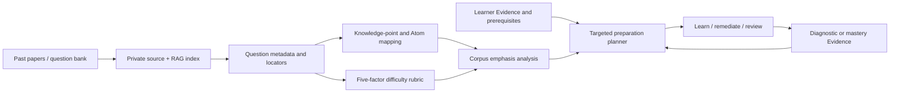

# AtomLearn 试题分析与针对性备考设计

## 1. 目标

当用户提供往年题、样题、模拟题或题库时，AtomLearn 应把题目转化为可追踪的考试语料证据，并回答四个不同问题：

1. 这批题覆盖了哪些知识点、题型和认知层级？
2. 在已提供样本内，哪些知识点出现更稳定、分值更高？
3. 每道题的难度依据是什么，估计有多可靠？
4. 结合当前学习者 Evidence 与先修状态，下一步应该学习、补救还是复习什么？

系统不把往年频率包装成命题预测，也不根据题目难度推断学习者智力。

## 2. 架构

完整原题与答案保留在用户资料/RAG 层；考试规范状态只保存摘要、locator 和结构化分析字段。

## 3. 独立 revision

试题库使用 `exam revision`，与以下 revision 隔离：

- course revision：学习状态、Atom、Evidence、问题和复习；
- RAG revision：题源与检索索引；
- adaptation revision：用户交互偏好；
- evolution revision：高影响课程变更提案。

追加一份往年卷不会让学习 Evidence 失效；学习者完成一次练习也不会改写历史题库。生成备考队列时同时标记 exam/course revision，旧结果可被识别并重新生成。

## 4. 题目结构化

每份试卷记录年份、场次、类型、总分、source ID 和 locator。每道题记录：

- 题号、题型、分值、简短题干摘要和 source locator；
- 认知层级和可选题族 ID；
- 五因素难度量表；
- 一个或多个知识点映射；
- 每个映射的权重、置信度、依据和可选 Atom ID。

映射权重总和必须为 `1.0`。缺失的 Atom 映射保留为 coverage gap，不能通过猜测强行补齐。

## 5. 难度确定

难度估计由概念负荷、推理深度、知识整合、执行负荷和时间压力组成，运行时使用固定权重计算 `1`-`5` 的估计值。若存在官方难度，则同时保存官方值和量表估值，并以官方值作为有效难度。

难度结果必须展示 `official`、`rubric` 或 `estimated` 依据与置信度。缺少评分细则、标准解法、时间限制或先修假设时，应降低置信度，而不是提高模型措辞的确定性。

## 6. 常考点统计

知识点强调分由三部分组成：

- 45%：跨试卷覆盖率；
- 30%：按题目内知识权重计算的相对出现量；
- 25%：存在分值时的相对分值贡献。

输出 `core`、`frequent`、`recurring`、`limited` 四档，并同时提供试卷数、题目数、年份、分值占比、平均难度和语料置信度。该分数只描述输入样本，不是未来命题概率。

## 7. 个性化学习与复习

备考优先级由以下因素组合：

- 50%：考试语料强调分；
- 35%：学习者当前缺口；
- 15%：题目平均难度。

学习者缺口来自 Atom 状态、confidence、最近 Evidence 结果和 review 状态。计划不会跳过未掌握先修，而会把目标标为 `repair_prerequisites`。其他动作是 `learn`、`remediate` 和 `review`。

每个建议都携带分数组成、依据题目、映射知识点和先修 ID。用户完成代表题后，结果通过已有 `record-evidence`/`assess` 写入课程状态；重新运行计划即可得到新的针对性队列，不另建一套学习成绩。

若设置目标考试日期，计划会报告剩余天数，并对已经过期或不足七天的窗口给出提醒。时间紧迫只影响迭代节奏，不得删除先修与掌握守卫。

## 8. RAG 与 Web Search

题目 PDF/DOCX/文本先进入已有 RAG。检索用于：

- 定位题目与评分细则；
- 将题目映射到教材知识和 Knowledge Atom；
- 区分直接考点、解题步骤与隐含先修；
- 在用户资料缺失时查找官方考试大纲、评分标准或可靠解法。

Web Search 只修补缺失证据，并通过 `rag ingest-web` 保存有限段落及 URL、检索时间和 locator。分析报告会显示多少试卷已连接 RAG/课程来源，未连接来源会成为显式限制。

## 9. 防误导边界

- 不声称高频知识点“必考”；
- 不将一次样本重复视为长期趋势；
- 不将难度等同于学习者能力；
- 不在诊断作答前默认泄露答案；
- 不因考试权重降低掌握门槛；
- 不让高频目标越过阻塞性先修；
- 不把低置信映射包装成已验证事实；
- 不把完整版权题目复制到规范状态或仓库。

## 10. 验收标准

- 支持增量导入多份试卷与 revision 冲突保护；
- 题目具备稳定来源 locator；
- 难度由固定量表派生并保留依据；
- 常考点包含语料置信度与限制；
- 未映射知识点显式出现；
- 计划结合 Evidence、先修和复习状态；
- 学习、复习和 mixed 三种队列可生成；
- `EXAM_BLUEPRINT.md` 与 `EXAM_STUDY_PLAN.md` 可重建；
- exam/root validation 均覆盖试题状态。
