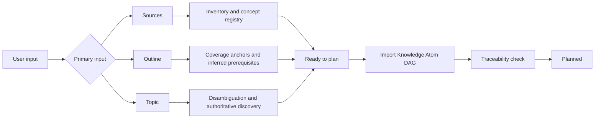

# AtomLearn 多输入入口设计

| 项目 | 内容 |
| --- | --- |
| 文档状态 | Implemented v1 |
| 更新时间 | 2026-08-14 |
| 支持入口 | 完整资料、用户大纲、领域关键词或名词 |
| 统一输出 | 来源可追踪的 Knowledge Atom DAG |

## 1. 设计目标

用户不应为了使用 AtomLearn 而先学会“如何设计课程”。系统需要接受信息密度差异很大的三类请求：

- 用户拥有完整教材、PDF、笔记、文档站或知识库；
- 用户只有课程大纲、目录或自己列出的学习清单；
- 用户只说出一个领域、概念、技能或想学的名词。

三类输入最终都进入同一套 Atom、先修、Evidence 和复习模型，但不能使用同一种建图策略。

## 2. Intake 状态机



状态包括：

- `captured`：输入已记录但尚未分类完成；
- `discovering`：关键词模式正在寻找权威来源；
- `ready_to_plan`：具备生成初始 DAG 的最低信息；
- `planned`：计划已导入并通过来源可追踪检查。

Intake revision 独立于课程、科研与进化 revision，避免旧会话覆盖新的输入假设或来源。

## 3. 完整资料模式

系统先建立资料清单和跨资料概念注册表，再进行 Atom 化。目录只用于定位，不能直接充当依赖图。多资料重复内容会合并，矛盾、版本差异和缺失先修会显式记录。

完成标准要求所有输入资料 ID 出现在课程 source 列表中，所有非归档 Atom 都有 source ID 和 locator。

## 4. 用户大纲模式

大纲是 coverage contract，不是最终 Atom 边界：

- 过大的标题会拆分；
- 重复目标会合并；
- 跨章节先修会重新连接；
- 大纲遗漏的桥接知识可作为 inferred Atom 添加；
- 大纲 item ID 作为 source locator 保留覆盖关系。

因此系统既尊重用户结构，又不会把不适合学习的目录顺序机械复制为课程。

## 5. 关键词模式

当用户只提供一个名词时，系统不要求用户补写大纲，而是：

1. 规范化术语和别名；
2. 记录最可能的含义和边界假设；
3. 只提出一至两个会实质改变路径的问题；
4. 主动寻找权威综述和技术来源；
5. 生成 10–30 个 provisional Atom；
6. 通过用户反馈与诊断 Evidence 继续调整。

关键词模式在没有 discovery source 时保持 `discovering`，不能被标记为规划完成，从而避免把模型记忆直接伪装成来源充分的课程。

## 6. 混合输入

混合输入选择信息最强的一类作为 primary mode，同时保留其他字段：教材加大纲以 `sources` 为主，大纲加关键词以 `outline` 为主，科研论文领域则可同时使用 topic intake 管理知识先修、Research mode 管理论文证据图。

## 7. 运行时文件与命令

```text
<workspace>/
├── INTAKE.md
└── .atomlearn/
    ├── intake.yaml
    └── intake-events.ndjson
```

命令包括 `intake init`、`status`、`guidance`、`update`、`complete`、`validate` 和 `render`。核心 `atomlearn validate` 会同时验证 Intake 状态。
