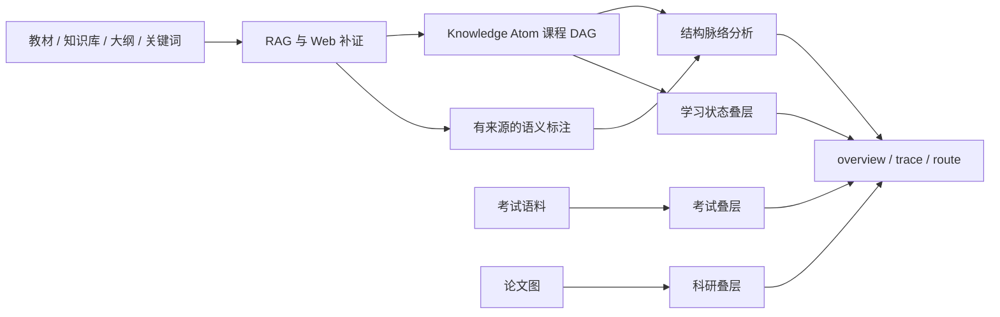

# AtomLearn 知识脉络功能设计

## 1. 目标

知识脉络功能要回答的不只是“先学什么”，还包括“为什么有这个概念、它解决了什么、由什么推到什么、与哪些概念容易混淆、最后用于哪里”。用户可以从完整教材、知识库、大纲、领域关键词、论文或往年题进入，但最终都能获得同一套可查询、可叠层、可追溯的知识地图。

本实现选择双层图模型：课程的先修 DAG 负责学习秩序，独立的语义图负责概念解释。两者共享 Knowledge Atom ID，却不混淆语义。这样既能提供丰富脉络，又不会因为一条“对比”或“应用”关系错误解锁课程内容。

## 2. 用户任务

系统支持四类核心问题：

1. 全局梳理：这个领域从哪些基础出发，主干和分支是什么；
2. 单点追溯：某个知识点的来龙去脉、上下游和边界是什么；
3. 两点连接：两个概念之间通过哪些先修或语义关系相连；
4. 目标叠层：为当前学习、考试重点或论文阅读展示最相关的路线。

## 3. 分层模型

### 3.1 结构层

结构层完全由已有课程 DAG 派生，不复制状态。它计算根节点、叶节点、拓扑序、最长学习主干、入度/出度枢纽、模块统计和跨模块桥。

结构层是确定性的，可以在语义图为空时立即使用。它也承担质量诊断：过多根节点可能说明缺少共同基础，超高出度节点可能需要拆分，意外的跨模块边可能表示原子化或先修判断有误。

### 3.2 语义层

语义层由三个记录构成：

- Annotation：一个 Atom 的角色、中心问题、贡献和边界；
- Relation：两个 Atom 之间有类型、有理由、有置信度和来源定位的关系；
- Thread：为某个目标策展的有序概念路线。

Relation 覆盖动机、定义、推导、推广、特化、对比、类比、扩展、精炼、取代、应用、实现、评价和跨域连接。Thread 覆盖学习主线、问题到解法、推导、比较、应用、历史演进、考试、科研和自定义路线。

### 3.3 叠层

学习叠层直接读取 Atom 状态、Active Atom 和复习状态。考试叠层读取考试分析中的样本内重点与覆盖缺口。科研叠层统计论文的 `concept_atom_ids`，显示哪些概念阻塞或支撑更多已映射论文。

各子系统 revision 相互独立。叠层是查询时投影，不将考试频率或论文数量写回课程先修结构。

## 4. 数据流

## 5. RAG 接入

自动结构分析不需要额外检索；非显然的语义关系必须经过检索和来源核对。Harness 先对关系的两端、关系类型和可能依据分别生成查询，通过现有 RAG 搜索用户资料。证据不足时再使用 Web Search 补齐权威材料，并通过 `rag ingest-web` 写入有限段落及 URL、查询、时间和 locator。

置信度高于 0.7 的关系必须引用课程或 RAG 已注册的来源。检索分数只决定候选排序，不等于关系可信度。冲突证据应通过 `contrasts`、boundary 或较低置信度表达，而不是强行合并成单一确定说法。

## 6. 查询设计

`overview` 接受 structure、learning、conceptual、exam、research 或 all 视角。输出适合机器继续选择内容，也由 `render` 生成 Mermaid 图与摘要表。

`trace` 对先修图做有深度上限的上下游 BFS，并计算一条严格终止在目标 Atom 的最长先修链。它同时返回目标的语义邻边、所在 Thread，以及考试和科研局部叠层。

`route` 在先修边和语义边组成的无向导航图上做最短路径搜索，但每个步骤都保留原始方向和遍历方向。导航的反向遍历不改变学习顺序。

## 7. 与教学的结合

全局地图用于 orientation，不应一次性变成长篇讲授。真正进入学习时仍保持唯一 Active Atom。若用户问“为什么现在学这个”，系统用当前 Atom 的 trace 解释主先修链、中心问题和下游价值；若问“它和另一个概念有什么关系”，使用 route 后只讲路径上必要的边。

地图本身不是 mastery Evidence。用户看懂图、点开节点或复述路线，都不能自动将 Atom 标记为 mastered，仍需使用原有 rubric 记录可观察 Evidence。

## 8. 与考试的结合

考试分析先从用户提供的试题样本得到知识点覆盖、难度和样本内重点。Lineage 的 exam 叠层把这些分数投射到课程图上。对于优先目标，系统先运行 trace，识别阻塞先修、推导主线和可用 Thread，再选择 `learn`、`review` 或 `repair_prerequisites`。

这避免了“高频知识点优先”破坏先修顺序。频率只描述给定题库，不能被表述为未来命题概率。

## 9. 与科研阅读的结合

论文映射使用 `concept_atom_ids` 指明阅读所需概念。research 叠层统计每个 Atom 支撑的论文数量和角色。遇到 Active Paper 的概念缺口时，系统保留论文位置，用 trace 给出最短可解释修复脉络，完成相应 Atom 后再回到论文。

论文引用图与知识语义图并不相同：前者描述文献之间的依赖、引用和证据关系，后者描述概念之间的知识关系。界面可以叠加，但规范状态继续分离。

## 10. 自适应与自进化边界

Session 自适应可以改变地图的呈现方式，例如优先图、表、例子、历史线或推导线；它不能改写语义事实或先修关系。

语义 Annotation 和 Thread 可以通过独立 lineage import 更新。真正的依赖边调整、Atom 拆分或合并仍必须走 restructure 或进化提案审批流程。这样能避免聊天偏好或一次检索结果直接改变课程结构。

## 11. 完整性与并发

Lineage 使用独立乐观并发 revision。每次 import 只产生一个事件，事件记录被更新的 Annotation Atom ID、新 Relation ID 和 Thread ID，不重复保存正文。

根级 `validate` 会联动校验 lineage。未知、缺失、仅指向归档节点的记录，重复关系，错误字段，事件断裂和缺少来源的高置信关系都会 fail closed。

## 12. 当前交付范围与后续扩展

当前版本交付结构分析、语义导入、六种视角、单点 trace、两点 route、Markdown/Mermaid 视图、考试/科研叠层、独立事件与 revision、根校验和自动化测试。

后续可在保持 schema 兼容的前提下增加：大型图的社区发现、多分辨率摘要、时间演化视角、交互式前端、关系撤销/替代记录，以及基于真实学习 Evidence 的路线效果评估。这些扩展都不应改变“先修 DAG 是学习顺序唯一权威”的原则。
