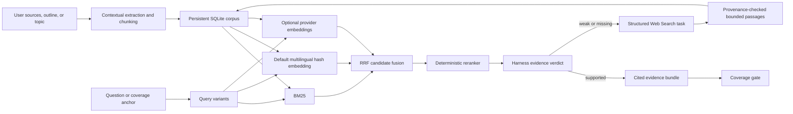

# AtomLearn RAG design

## 1. Outcome

AtomLearn now uses a provider-neutral, persistent retrieval layer for user knowledge bases and harness Web Search. The design is optimized for three realities:

1. a learner may provide a complete textbook or private knowledge base;
2. an outline names coverage but usually lacks explanatory evidence;
3. a topic keyword provides neither structure nor sources.

The system therefore combines local indexing with a corrective Web Search loop and fails closed when evidence coverage is not explicitly verified.

## 2. Research basis

The original RAG formulation separated parametric model knowledge from an explicit non-parametric memory, improving provenance and knowledge updating for knowledge-intensive tasks ([Lewis et al., 2020](https://arxiv.org/abs/2005.11401)). AtomLearn adopts that separation: course state and retrieved evidence remain inspectable rather than being hidden in a model response.

Pure dense retrieval is not a sufficient default. Exact identifiers, technical terms, titles, names, and acronyms remain important, while semantic retrieval helps paraphrases. Anthropic's Contextual Retrieval work reports substantially lower top-20 retrieval failure from contextual chunks, hybrid BM25/embedding retrieval, and reranking ([Anthropic, 2024](https://www.anthropic.com/engineering/contextual-retrieval)). Microsoft likewise documents hybrid keyword/vector retrieval followed by reciprocal rank fusion and semantic reranking ([Azure AI Search hybrid search](https://learn.microsoft.com/en-us/azure/search/hybrid-search-overview), [RRF scoring](https://learn.microsoft.com/en-us/azure/search/hybrid-search-ranking)).

Retrieval must be evaluated, not blindly trusted. Corrective RAG uses a retrieval evaluator and invokes web search when the static corpus is insufficient ([Yan et al., 2024](https://arxiv.org/abs/2401.15884)). Self-RAG similarly argues against indiscriminately retrieving a fixed number of passages and adds adaptive retrieval and reflection ([Asai et al., 2023](https://arxiv.org/abs/2310.11511)). AtomLearn implements those operational lessons as explicit `supported`, `weak`, `missing`, and unverified states.

Hierarchical and graph retrieval are valuable but should be selective. RAPTOR retrieves across recursive summaries for questions requiring long-document abstraction ([Sarthi et al., 2024](https://arxiv.org/abs/2401.18059)). GraphRAG targets corpus-wide or "global" questions that naïve chunk vector search handles poorly, with an additional indexing-cost tradeoff ([Microsoft Research GraphRAG](https://www.microsoft.com/en-us/research/project/graphrag/)). AtomLearn therefore keeps contextual chunk retrieval as the default and recommends summary or graph sources only for very large corpora and global synthesis.

## 3. Selected architecture

### 3.1 Persistent local index

SQLite FTS5 provides a zero-service BM25 index that works inside a Skill workspace. It avoids requiring an API key, vector database, network service, or a specific model vendor. Canonical source revisions and chunks are stored under `.atomlearn/rag/`; generated `RETRIEVAL.md` exposes only an operational view.

### 3.2 Contextual, structure-aware chunks

Extractors preserve page, line, paragraph, JSON-path, row, heading, table, formula, OCR-page, and web-section locators. HTML headings, lists, and tables and DOCX paragraphs and tables retain their structure. PDF extraction records text, detected formulas, and `pdfplumber` tables. For image-only pages it first uses an auditable OCR sidecar, then optionally invokes PyMuPDF, Pillow, and Tesseract. `ocr: required` prevents silent loss of any empty page. Each indexed chunk is prefixed with document title, section, and locator. Default chunks target roughly 700 tokens by using a 2,800-character bound and 300-character overlap.

### 3.3 Hybrid retrieval and fusion

The default candidate pool contains:

- FTS5 BM25 results for the main and alternate queries;
- a deterministic local multilingual hash embedding, including Chinese character n-grams;
- optional cosine ranking when provider embeddings exist.

RRF with `k=60` fuses rank positions without trying to compare incompatible raw BM25 and cosine score scales. The output keeps every component rank and raw component score for inspection.

Every chunk receives `atomlearn/multilingual-hash-v1` by default. This embedding is local, versioned, deterministic, and requires no service or model download. It captures multilingual word/subword overlap but is deliberately not advertised as learned semantic understanding. Conceptual synonym recall still benefits from harness-generated query variants or an approved provider embedding.

An attached embedding batch establishes one explicit model-and-dimension profile per workspace. Query embeddings must name and match that profile, preventing silent fusion of incompatible vector spaces.

### 3.4 Deterministic reranking and harness judgment

`atomlearn/deterministic-reranker-v1` reranks the fused candidate pool using query coverage, title/section coverage, exact-phrase signal, authority prior, locator quality, and normalized RRF rank. The component scores make ordering reproducible and directly testable. It does not decide truth: the harness still judges direct support, authority, recency, agreement, and locator quality. RRF and reranker scores are never treated as calibrated confidence.

### 3.5 Corrective Web Search

The RAG engine does not secretly crawl the web. `rag correct` converts each failed coverage requirement into a structured search task. The harness uses its native search, opens authoritative results, and submits bounded evidence containing URL, retrieval time, query, authority, version, section, locator, and text. The same command ingests that evidence, reruns retrieval, reevaluates coverage, and either closes the gate or emits the next correction round. This preserves the browser/search tool's security and citation behavior while making retrieved evidence durable and auditable.

### 3.6 Coverage gate

For outline intake, every stable outline ID becomes a required retrieval anchor. For topic intake, every topic term requires authoritative support and the overall goal requires two distinct sources. Research-field discovery requires evidence for the research question, surveys, method families, evaluations/datasets, and critique/replication work. A coverage run without harness verdicts intentionally fails. `supported` requires active evidence, all source/authority constraints, and evidence drawn from the freshly retrieved candidates for that exact requirement; `weak`, `missing`, or unverified evidence triggers Web Search.

Coverage is tied to the selected intake or research revision. Any canonical scope update makes the old report stale. The intake engine will not become `ready_to_plan` until the current intake report passes.

Initial evaluation returns candidate bodies to the invoking harness for reranking, but canonical `latest-coverage.yaml` stores only candidate IDs and accepted evidence provenance. This avoids duplicating source content in long-lived YAML state.

## 4. Source lifecycle and provenance

Re-ingesting a stable source ID creates a new source revision. Old chunks become inactive but remain available for audit. Active search never returns superseded chunks. Source registry entries record revision hashes, versions, origin, authority, URI, retrieval time, and chunk count.

Web URLs containing credentials are rejected. Future or timezone-free retrieval dates are rejected. Passage and file bounds limit accidental corpus abuse. Query logs store queries and returned IDs, while source text stays inside the learner workspace and is excluded by repository `.gitignore` rules.

## 5. Retrieval security

Every search response instructs the harness to treat retrieved content as untrusted evidence. Commands embedded in pages, papers, HTML, notes, and knowledge bases are data, not agent instructions. The workflow never stores browser cookies, authorization headers, passwords, or tokens. Private source files are indexed locally and never copied into the Skill repository.

## 6. Quality evaluation

The operational gate verifies evidence sufficiency per coverage anchor. `rag evaluate` runs a versioned, deterministic benchmark over labeled retrieval and answer-grounding cases and reports:

- recall@k for required evidence;
- mean reciprocal rank and nDCG@k for ordering;
- citation correctness against labeled supporting chunks;
- unsupported-claim rate with explicit abstention handling;
- source diversity for claims that require corroboration;
- freshness failures for versioned or current topics;
- Web Search correction rate and gaps that remain unresolved.

Configurable thresholds produce a quality gate and every metric includes per-case diagnostics. Evaluate retrieval separately from generation so a fluent answer cannot hide missing evidence. Add failure queries whenever learners expose a synonym, language, document-structure, OCR, table, formula, or global-context retrieval miss.

## 7. Alternatives and extension points

- Hosted vector database: attach embeddings now; replace the dense ranker later behind the same chunk/source IDs if scale requires it.
- Learned cross-encoder reranker: add a provider adapter behind the current deterministic candidate contract, but preserve harness verdicts, offline tests, and provenance.
- Hierarchical RAG: ingest section and document summaries as separate, clearly labeled sources for long textbooks.
- GraphRAG: use for corpus-wide research synthesis when entities, communities, and global questions justify its indexing cost; do not make it a prerequisite for ordinary courses.
- Connectors: ingest permission-checked passages from Drive, SharePoint, Zotero, or other harness connectors through the same local/web manifest contract.

## 8. Definition of done

RAG integration is complete when:

- all supplied sources are inventoried and indexed or explicitly rejected with a reason;
- retrieval returns stable locators and source revisions;
- a deterministic reranker produces inspectable component scores and the harness records evidence verdicts;
- weak/missing outline or topic anchors produce structured corrective Web Search tasks;
- authoritative web evidence is opened, provenance-checked, and ingested;
- evidence belongs to the current requirement's retrieved candidate set;
- the labeled benchmark passes recall@k, MRR, nDCG, citation-correctness, and unsupported-claim thresholds;
- the current intake coverage gate passes;
- the course plan cites registered source IDs and Atom locators;
- `rag validate` and workspace `validate` both pass.
