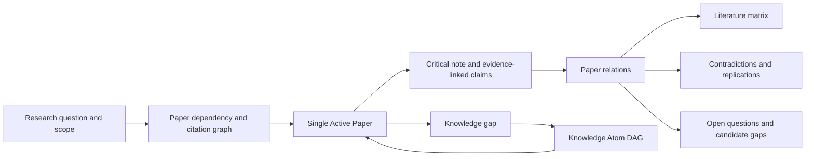

# AtomLearn 科研论文阅读设计

| 项目 | 内容 |
| --- | --- |
| 文档状态 | Implemented v2 |
| 更新时间 | 2026-08-14 |
| 产品定位 | 问题导向、证据导向的领域论文阅读与综合 |
| 核心原则 | Question -> Map -> Read -> Extract Evidence -> Relate -> Synthesize |

## 1. 目标

研究型阅读与学科学习不同：目标不是按章节掌握稳定知识，而是围绕一个尚未完全解决的问题，理解领域结构、比较方法与证据、识别争议，并形成可继续检验的研究方向。

本功能需要解决：

- 面对一个领域时，先读什么、后读什么；
- 如何避免只收藏论文或生成彼此孤立的摘要；
- 如何区分作者主张、实际证据和阅读者推断；
- 如何连接综述、奠基工作、方法、基准、批评与复现；
- 如何从多篇论文中得到有出处的争议、限制和候选研究空白；
- 如何在遇到知识障碍时回到 Knowledge Atom 补足先修，同时保留论文阅读位置。

## 2. 双层模型



两层状态彼此连接但不混合：

- Knowledge Atom DAG：管理概念、数学、方法和工具等学习先修；
- Paper graph：管理论文角色、阅读先修、引用、主张、证据、局限与论文间关系。

课程 revision 与 research revision 相互独立。论文笔记不会伪装成掌握 Evidence，课程学习也不会隐式改变论文状态。

## 3. 领域建图策略

首批建议纳入 8–20 篇具有不同角色的代表论文，而不是追求数量：

1. Survey：建立词汇、子方向和争议地图；
2. Seminal：理解问题最初如何被提出；
3. Theory/Method：覆盖主要理论与代表性方法族；
4. Benchmark/Dataset：理解证据由什么任务、样本和指标定义；
5. Critique/Replication：检验被广泛接受的结果是否稳健；
6. Application：检验迁移性和外部有效性；
7. Recent challenger：在基础明确后跟踪新近变化。

阅读先修使用 `prerequisite_paper_ids` 表示；论文内部引用使用 `cites` 表示。未导入的文献只记录在 `external_citations`，避免把不完整元数据伪装成受管理节点。

导入时会把 DOI URL/前缀规范为裸 DOI，并按精确 DOI 或规范化标题自动合并重复记录、保存 alias、重写引用和阅读先修。`research reconcile-metadata` 会验证标题、DOI、年份和作者交集，只补齐通过验证的缺失字段；`research fetch-metadata` 可直接从 Crossref 或 OpenAlex 获取元数据和外向引用。冲突和未解析引用都作为显式结果保留。

## 4. 单篇论文完成标准

一篇论文必须记录以下内容后才能从 `active` 进入 `read`：

- 它解决的问题；
- 至少一项具体贡献；
- 方法、理论论证或研究设计；
- 至少一个“主张—证据摘要—证据强度”记录；
- 至少一个限制或有效性边界；
- 它在领域中的位置。

证据强度使用 `weak`、`mixed`、`moderate`、`strong`、`unclear`。这不是对论文做简单打分，而是要求主张的确定程度与实际证据匹配。

论文之间可建立：`supports`、`extends`、`contradicts`、`replicates`、`compares`。关系说明必须指出具体主张、设置或证据差异。

## 5. 导向机制

`research next` 只返回阅读先修已经完成的论文，并综合：

- 用户声明的优先级；
- 论文角色在领域建图中的顺序；
- 年份和稳定 ID；
- 尚未掌握的 `concept_atom_ids`。

如果候选论文依赖未掌握的 Knowledge Atom，系统仍展示论文，但明确给出应先修复的 Atom。论文先修未完成时则阻止激活。

任一时刻最多一个 Active Paper。切换前必须完成或 park 当前论文，防止研究阅读再次变成无边界的标签页堆积。

## 6. 综合输出

系统生成四个研究视图：

- `RESEARCH_MAP.md`：问题、范围、论文角色、状态与依赖；
- `CURRENT_PAPER.md`：当前论文、阅读透镜、主张和开放问题；
- `LITERATURE_MATRIX.md`：跨论文贡献、方法、主张、局限与领域位置；
- `RESEARCH_GAPS.md`：开放问题、重复局限、矛盾、复现结果和下一批候选。

`research synthesize` 将已完成论文标记为 `synthesized`，并基于主张文本相似性生成跨论文证据主题。每个主题保留 paper/claim ID、证据摘要、强度、论文间关系与局限；支持/扩展/复现可形成 corroborated 主题，矛盾关系形成 contested 主题，只有一篇来源时明确标为 single-source。它不会自动宣称发现了创新点。研究空白首先是候选假设，必须经过最新文献检索、相邻术语检索和反例检查。

## 7. 状态与审计

```text
<workspace>/.atomlearn/research/
├── state.yaml
├── events.ndjson
└── papers/
    └── <paper-id>.yaml
```

所有 mutation 使用独立的 `--expected-research-revision` 防止旧会话覆盖新状态。事件日志记录导入、激活、笔记、完成、park、exclude 和综合操作。

完整论文正文不会写入状态。工作区只保存书目信息、稳定 locator 和简短分析，降低版权、隐私和仓库体积风险。

若论文已通过 RAG 建立索引，`research attach-source` 会把论文节点绑定到共享 Document IR 的 source revision、内容 hash 和 block count。该绑定提供跨检索与科研阅读一致的来源身份，但不会把 IR block text 复制到 research state。

## 8. 命令闭环

```text
research init -> research import -> metadata reconcile/fetch -> optional Document IR attach -> research next -> research activate
              -> research note -> research complete -> research synthesize
```

辅助命令包括 `status`、`validate`、`list`、`render`、`park` 和 `exclude`。核心 `atomlearn validate` 同时校验研究状态。

## 9. 后续演进

后续可在不破坏当前模型的前提下增加：

- 版本/预印本族合并与撤稿状态检查；
- PRISMA 风格的系统综述筛选日志；
- 可学习的跨语言 claim matching 与人工主题合并；
- 自动发现需要补足的 Knowledge Atom 候选；
- 基于新论文的增量检索提醒；
- 将研究阅读指标接入有审批边界的 Self-Evolution 提案。
