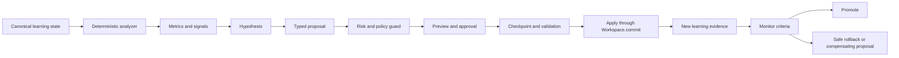

# AtomLearn 自进化设计

| 项目 | 内容 |
| --- | --- |
| 文档状态 | Implemented v1 |
| 更新时间 | 2026-08-14 |
| 适用范围 | 单个 AtomLearn 课程工作区的高影响课程进化通道 |
| 默认模式 | `proposal_only` |
| 核心原则 | Observe -> Hypothesize -> Propose -> Approve -> Apply -> Measure -> Promote/Roll back |

## 1. 设计目标

AtomLearn 的自进化不是让模型随时改写自身，而是把学习过程中出现的问题转成可追踪、可审批、可验证、可回滚的变更。系统需要做到：

- 从 Evidence、复习、问题分流和先修回退中提取结构化信号；
- 把信号转成包含观测依据、假设、变更内容和成功标准的提案；
- 按风险决定审批权限，并在应用前执行完整状态验证；
- 用后续学习证据检验提案，而不是用主观感觉宣告改进；
- 在安全条件满足时恢复检查点，同时保留全部学习历史；
- 将运行时课程适应与 Skill 源代码升级严格隔离。

聊天 session 中的低风险表达偏好由独立的 `adapt` 通道处理，不进入本提案状态机。该通道使用单独的 adaptation revision，只允许白名单枚举值，并要求行为推断跨 session 交叉印证；详见[会话自适应设计](SESSION_ADAPTATION_DESIGN.md)。课程结构、掌握门槛、复习规则和 Skill 代码仍严格遵守本文的审批式进化流程。

## 2. 非目标

- 不允许课程工作区直接修改已安装的 `SKILL.md` 或脚本；
- 不自动吸收学习者的原始对话、个人信息或完整资料内容；
- 不用完成速度单独代表学习效果；
- 不跨工作区聚合数据，除非未来增加独立的显式授权设计；
- 不通过恢复旧快照覆盖已经发生的新学习活动。

## 3. 核心架构



系统保留两条相互独立的并发控制线：

- `course revision` 保护课程、Atom、Evidence、问题和复习状态；
- `evolution revision` 保护策略、指标、假设、提案和实验状态。

另有一条隔离的 `adaptation revision`，只保护 session 信号与派生偏好画像。它的频繁更新不会让课程进化提案过期，也不能直接修改课程或进化状态。

提案同时记录其 `base_course_revision`。课程已变化的旧提案不得直接应用，从而避免自进化覆盖正常学习进展。

## 4. 运行时数据模型

新建课程时会初始化：

```text
<workspace>/
├── EVOLUTION.md
└── .atomlearn/evolution/
    ├── policy.yaml
    ├── state.yaml
    ├── metrics.yaml
    ├── hypotheses.yaml
    ├── ledger.ndjson
    ├── proposals/
    ├── experiments/
    └── checkpoints/
```

其中：

- `policy.yaml`：模式、权限、数值边界、隐私规则和受保护不变量；
- `state.yaml`：进化 revision、ID 序列和最后分析时间；
- `metrics.yaml`：由规范状态派生的聚合指标和信号；
- `hypotheses.yaml`：开放、已验证或已拒绝的假设；
- `proposals/*.yaml`：带类型、风险、审批和生命周期的变更提案；
- `experiments/*.yaml`：基线、当前指标和逐项判定结果；
- `checkpoints/*.yaml`：应用前的最小可逆状态，不复制原始回答或问题文本；
- `ledger.ndjson`：进化状态机的追加式审计记录；
- `EVOLUTION.md`：从规范状态生成的人类可读视图。

## 5. 信号与提案

首版分析器使用确定性规则，避免模型在数据不足时“发现”不存在的规律：

| 信号 | 默认条件 | 建议提案 |
| --- | --- | --- |
| 重复掌握失败 | 同一 Atom 至少 2 次未通过 | `teaching_strategy` |
| 维度分数分化 | 多次尝试且维度差距明显 | `split_atom` 候选 |
| 延迟复习失败 | Atom 存在失败复习 | `adjust_mastery` |
| 重复阻塞回退 | 同一目标出现多次阻塞问题 | `add_dependency` 候选 |

每个自动生成的假设必须引用真实的 Evidence、Question、Review 或 Event ID。结构语义不完整时，分析器只生成 `ready_to_apply: false` 的候选，等待人工补充，不猜测新的 Atom 内容或依赖端点。

## 6. 进化类型与风险

| 类型 | 风险 | 作用域 | 运行时应用 |
| --- | --- | --- | --- |
| `teaching_strategy` | low | 学习者 | 审批后允许 |
| `adjust_review_intervals` | low | 学习者/课程 | 边界内允许 |
| `adjust_mastery` | medium | Atom | 验证并重新取证后允许 |
| `add_dependency` | medium | DAG 边 | DAG 验证后允许 |
| `remove_dependency` | medium | DAG 边 | DAG 验证后允许 |
| `split_atom` | medium | Atom 结构 | 复用 restructure 守卫 |
| `merge_atoms` | medium | Atom 结构 | 复用 restructure 守卫 |
| `patch_skill` | high | Skill 源代码 | 始终禁止 |

风险由类型决定，提案输入不能降低自身风险。低/中风险默认需要 learner 权限，高风险需要 maintainer 权限；即使 maintainer 已批准，`patch_skill` 也只能成为仓库级候选，不能由课程运行时执行。

## 7. 提案生命周期

```text
proposed -> approved -> applied -> monitoring -> promoted
    |          |          |            |
    +----------+----------+------------+-> rejected / rolled_back / blocked
```

关键守卫：

1. `preview` 展示依据、风险、变更、成功标准、陈旧状态和校验错误；
2. `approve` 检查策略要求的权限和提案完整性；
3. `apply` 再次检查两个 revision、策略边界和全量 Workspace 验证；
4. 应用前创建最小检查点；
5. 课程变更只通过既有 `Workspace.commit` 提交；
6. `monitor` 在观测数不足时返回 `insufficient`，所有条件通过才 `promoted`；
7. 失败只给出复核/回滚建议，不执行破坏性自动回滚。

## 8. 应用和回滚语义

- 教学策略仅更新进化策略，不增加课程 revision；
- 复习间隔只影响未来安排，不篡改历史复习记录；
- 提高掌握要求时，原有 Evidence 保留，相关 Atom 转为需要重新验证；
- 依赖变更必须保持 DAG 无环，并在必要时要求重新验证；
- 拆分/合并调用已有 restructure 逻辑，保留 alias、Evidence 和问题引用；
- 结构回滚不会删除新 Atom，而是将其归档并写明原因。

自动回滚只在当前课程 revision 等于提案应用后的 revision 时允许。若学习者已经继续学习，恢复旧检查点会丢失新 Evidence，因此系统拒绝回滚并要求建立补偿提案。

## 9. 评估规则

任何效果评估都先检查硬门槛：

- Workspace 校验错误为 0；
- Active Atom 数不超过 1；
- 不存在无 Evidence 的 mastered Atom；
- 进化状态不保存原始消息。

支持 Atom、课程和系统级指标，例如平均得分、尝试数、掌握失败、复习失败、维度分化、课程掌握率、开放问题数和校验错误数。成功标准支持 `gte`、`lte`、`gt`、`lt`、`eq`，并可声明 `min_observations`。

历史回放只能验证状态完整性，不能证明教学策略的反事实收益。对学习效果的判断应优先使用提案应用后的新 Evidence 和延迟复习结果。

## 10. 安全与隐私

- 默认 `mode: proposal_only`，不存在隐式自动应用；
- `store_raw_messages: false`、`cross_workspace_aggregation: false`；
- 指标只保存计数、均值、Atom ID 和规范记录 ID；
- 检查点只保留回滚所需结构和引用字段；
- 受保护不变量不能被策略或提案关闭；
- 所有 mutation 均进入事件日志和进化 ledger；
- Skill 源代码升级必须通过正常仓库修改、测试、官方校验和发布流程。

## 11. 已实现命令

```text
atomlearn.py evolve status <workspace>
atomlearn.py evolve validate <workspace>
atomlearn.py evolve list <workspace> [--status <status>]
atomlearn.py evolve policy <workspace>
atomlearn.py evolve analyze <workspace> [--propose]
atomlearn.py evolve propose <workspace> --input <proposal.yaml>
atomlearn.py evolve preview <workspace> <proposal-id>
atomlearn.py evolve approve <workspace> <proposal-id> --authority <role> --actor <name>
atomlearn.py evolve reject <workspace> <proposal-id> --reason <reason>
atomlearn.py evolve apply <workspace> <proposal-id>
atomlearn.py evolve monitor <workspace> <proposal-id>
atomlearn.py evolve rollback <workspace> <proposal-id> --reason <reason>
```

所有会改变进化状态的命令都支持 `--expected-evolution-revision`，用于阻止旧会话覆盖新提案状态。

## 12. 验证与后续演进

当前自动测试覆盖初始化、提案审批、策略应用、课程 mutation、陈旧提案、运行时 Skill patch 拒绝、证据驱动分析、结构回滚以及发生新学习后的回滚拒绝。

后续阶段应按以下顺序推进：

1. 用真实但去标识化的课程运行验证信号阈值；
2. 为同类型提案积累独立评估夹具；
3. 只有在低风险提案长期稳定后，才设计 `bounded_auto` 的自动应用入口；
4. 设计单独授权的跨工作区匿名统计层；
5. 将 `patch_skill` 候选接入仓库级测试与人工发布流程，但继续禁止运行时自修改。
