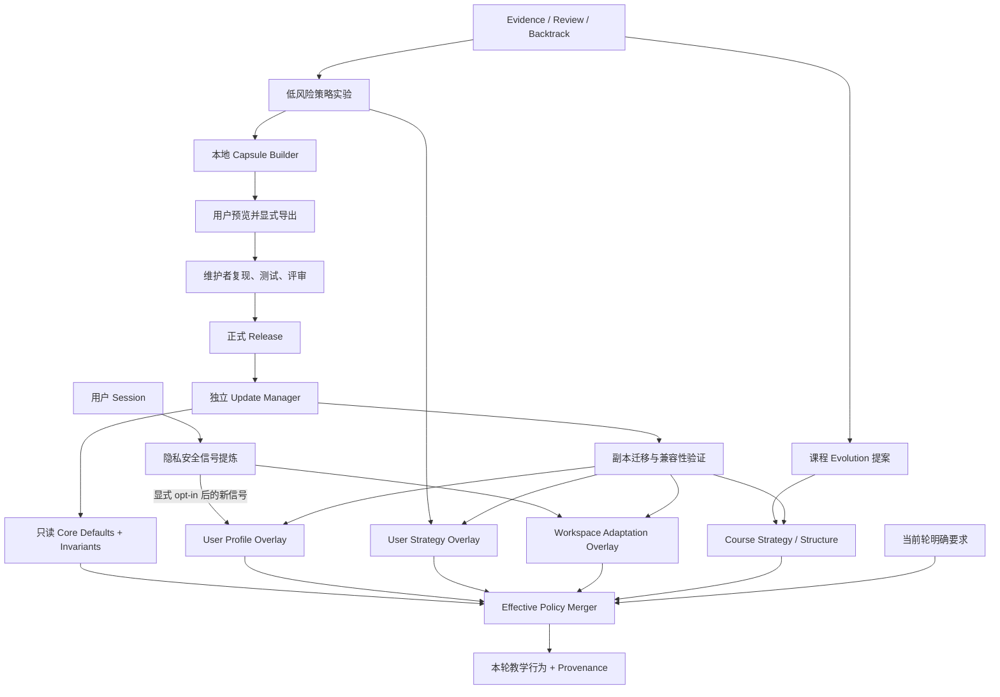

# AtomLearn 自进化 v2 设计

| 项目 | 内容 |
| --- | --- |
| 文档状态 | Implementation in progress；Phase 0 已实现 |
| 更新时间 | 2026-08-15 |
| 前置基线 | [自进化 v1](SELF_EVOLUTION_DESIGN.md)、[Session Adaptation](SESSION_ADAPTATION_DESIGN.md) |
| 适用范围 | 用户跨课程个性化、课程内有边界进化、产品级证据发布闭环 |
| 核心原则 | 让本地行为通过数据和策略进化，让公共产品通过测试和版本发布进化 |

实现采用的权限决策见 [ADR 0001](adr/0001-self-evolution-v2-boundaries.md)，攻击面、控制和发布安全闸门见[威胁模型](SELF_EVOLUTION_V2_THREAT_MODEL.md)。

## 1. 结论

建议方案符合 AtomLearn 的设计目标，且补中了当前实现最重要的缺口：现有 `adapt` 已能在单个 workspace 内学习低风险表达偏好，现有 `evolve` 已能对课程策略和结构做提案、审批、监测与回滚，但还没有跨课程用户 Overlay、确定性 schema migration、可信版本更新和产品级反馈闭环。

方案应采纳，但需要以下修正后再实施：

1. **偏好和效果策略必须分开。**“我喜欢先看例子”是偏好，可显式立即生效；“先看例子能让我学得更好”是效果假设，只能经实验进入策略 Overlay。
2. **Effective Policy 不能只返回合并值。**每个值都必须携带来源、作用域、证据等级、版本和被覆盖原因，使用户能理解“为什么本轮这样教”。
3. **不能简单在不同 Atom 间交替策略后声称因果改进。**Atom 的难度、类型和先验知识会造成混淆；实验需要分层、确定性分配、延迟复习指标和保守晋升规则。
4. **更新器不能属于课程运行时的自修改能力。**应由独立、稳定、受信任的管理器安装已签名或至少具有可信清单和哈希的正式 release；`main` 不是更新源。
5. **Evolution Capsule 不能只删掉原始消息就称为匿名。**还必须去除路径、原始 Atom/资料标识、细粒度时间和可重识别组合，并让用户在导出前预览。
6. **跨课程个性化必须显式 opt-in。**启用后也不应默认吸收已有 workspace 历史；历史偏好应由用户选择提升，或只从启用后的新信号开始。
7. **产品级进化不是本地运行时状态的一层。**它是独立的软件供应链：候选 -> 可复现测试 -> 评审 -> release -> 迁移。

因此，v2 不替换 v1，而是在 v1 的安全边界外增加两个闭环：用户级 Overlay 闭环和正式发布闭环。

## 2. 目标与非目标

### 2.1 目标

- 让用户明确选择的稳定偏好在不同课程之间延续；
- 让同一课程保留自己的局部偏好并覆盖全局偏好；
- 从学习结果中产生低风险、可撤销、可验证的教学策略实验；
- 为每轮教学生成可解释、可复现的 Effective Policy；
- 让用户数据与 Core Skill 的安装、升级和回滚解耦；
- 用确定性迁移维护 profile、strategy 和 workspace 的版本兼容性；
- 允许用户主动导出最小化、可预览的产品改进 Capsule；
- 让公共改进只通过测试、评审和正式 release 进入 Core Skill。

### 2.2 非目标

- 不让课程运行时修改 `SKILL.md`、Python、默认策略或安装目录；
- 不把聊天记录、自由文本摘要、完整回答或资料内容写入用户画像；
- 不推断智力、人格、健康、政治、宗教、残障等敏感属性；
- 不把更快完成、更多互动或更高满意度单独当作学习效果提升；
- 不让个性化降低掌握门槛、绕过先修、弱化 RAG 或安全要求；
- 不默认上传遥测，不默认跨 workspace 汇总，不默认自动更新；
- 不承诺从单用户、小样本实验得到严格的普适因果结论。

## 3. 已实现基线与缺口

| 能力 | 当前状态 | v2 处理 |
| --- | --- | --- |
| workspace-local 表达偏好 | 已实现，独立 adaptation revision | 保持兼容，作为 course Overlay |
| 枚举信号、无原始对话、冲突状态 | 已实现 | 复用同一信号契约 |
| 课程级提案、审批、监测、回滚 | 已实现 | 保持为 course evolution 通道 |
| 运行时拒绝 `patch_skill` | 已实现 | 升级为 Core 只读不变量 |
| 跨课程稳定偏好 | 未实现 | 新增 opt-in user profile |
| 跨课程效果策略 | 未实现 | 新增 user strategy store 与实验 |
| Effective Policy 合并和解释 | 未实现 | 新增确定性合并器 |
| 多 schema 迁移 | 未实现 | 新增迁移注册表、计划、验证和回滚 |
| Core release 更新 | 未实现 | 新增独立 manager 与版本化 release |
| 产品级匿名反馈 | 未实现 | 新增本地 Capsule 预览/导出 |

## 4. 三个进化平面



### 4.1 用户平面

用户平面包含两个不同对象：

- `profile`：用户明确或安全推断的表达偏好；
- `strategy`：经结果实验支持的低风险教学策略。

两者都只改变呈现和教学编排，不改变正确性标准。全局用户平面默认关闭，启用后也只接受严格 schema 的枚举记录。

### 4.2 课程平面

课程平面继续由 `.atomlearn/` 管理：Atom、Evidence、复习、问题、RAG、考试、科研、workspace adaptation 和 bounded evolution。结构和掌握规则仍通过现有提案审批通道改变。

### 4.3 产品平面

产品平面不读取用户状态来直接改代码。它只接收用户主动导出的 Capsule 或维护者创建的失败夹具，再通过仓库测试、Skill 校验、评审和 release 发布改进。

## 5. 信任边界与存储布局

Core Skill 安装目录必须视为只读。课程、用户和反馈状态分别存储：

```text
<core-install>/                         # 只读，由 release manager 管理
└── atom-learn/<version>/
    ├── SKILL.md
    ├── scripts/
    ├── references/
    └── assets/

<user-data-root>/                       # platformdirs.user_data_dir
├── profiles/
│   └── <profile-id>/
│       ├── state.yaml
│       ├── profile.yaml
│       ├── signals.ndjson
│       └── ledger.ndjson
├── strategies/
│   └── <profile-id>/
│       ├── state.yaml
│       ├── policy.yaml
│       ├── experiments/
│       ├── exposures.ndjson
│       └── ledger.ndjson
├── feedback/
│   └── evolution-capsules/
└── migrations/
    └── migration-state.yaml

<course-workspace>/
└── .atomlearn/
    ├── adaptation/                     # course Overlay
    ├── evolution/                      # course proposals/experiments
    └── ...
```

推荐使用 `platformdirs.user_data_dir("AtomLearn", "AtomLearn")`，并允许测试或便携场景通过 `ATOMLEARN_DATA_DIR` 显式覆盖。覆盖路径必须解析为绝对路径；任何 migration、reset 或 export 都不得接受未解析的通配符。

用户数据目录不应存放 Core release。release 缓存、暂存和上一个版本由独立 manager 管理，避免用户状态与可执行代码共享权限边界。

## 6. 版本包络与兼容性

每个规范状态文件只声明自己所属 schema，不复制其他子系统的 schema version：

```yaml
kind: atomlearn.user-profile
schema_version: 2
created_by_core_version: 0.12.0
last_written_by_core_version: 0.12.0
min_reader_core_version: 0.12.0
revision: 7
```

设计选择：

- `schema_version`：该 namespace 的确定性迁移版本；
- `created_by_core_version`：仅审计，不参与兼容判断；
- `last_written_by_core_version`：定位最后写入者；
- `min_reader_core_version`：阻止旧 Core 误读新语义；
- 写兼容性由 Core manifest 中每个 namespace 的 `read_range` / `write_version` 决定；
- 不使用单个模糊的 `minimum_core_version` 同时表达读写能力。

Core release manifest 示例：

```yaml
core_version: 0.13.0
schemas:
  user_profile:
    read: [1, 2]
    write: 2
  user_strategy:
    read: [1]
    write: 1
  workspace_core:
    read: [1]
    write: 1
release_channel: stable
artifact_sha256: "..."
```

## 7. Effective Policy

### 7.1 合并顺序

对于同一可个性化字段，优先级为：

1. 不可覆盖的安全、隐私和学习完整性不变量；
2. 用户当前轮明确要求；
3. 当前课程的显式偏好；
4. 用户全局显式偏好；
5. 当前课程已激活的推断偏好；
6. 用户全局已激活的推断偏好；
7. 当前课程已晋升的效果策略；
8. 用户全局已晋升的效果策略；
9. Core 默认策略。

当前轮要求高于历史画像，但不能覆盖不变量。例如“直接跳过掌握检查”只能进入显式 flexible-progression 流程，不能成为 presentation policy。

效果策略低于偏好：系统不能因为实验认为 `example_first` 更有效，就压过用户明确的 `formal_first` 偏好。

### 7.2 合并算法

合并器必须是纯函数，输入包含 Core manifest、上下文、当前轮 overrides、course profile、user profile、course strategy、user strategy 和 feature flags：

1. 验证每层 schema、revision 和 Core 兼容范围；
2. 丢弃非当前 context 可用的字段；
3. 将 `needs_review`、`forbidden`、`provisional`、`contested` 值排除；
4. 按字段而不是整份文件应用优先级；
5. 应用 task-fitness 和 protected-invariant 约束；
6. 返回值、来源和所有被忽略候选；
7. 计算确定性 `policy_fingerprint`，用于实验和调试。

输出示例：

```yaml
context: teaching
core_version: 0.13.0
policy_fingerprint: sha256:...
effective:
  explanation.order:
    value: example_first
    source: workspace_explicit
    source_revision: 4
  feedback.style:
    value: direct
    source: user_global_explicit
    source_revision: 7
ignored:
  - dimension: explanation.order
    value: intuition_first
    source: user_strategy
    reason: overridden_by_workspace_explicit
invariants:
  one_active_atom: enforced
  mastery_requires_evidence: enforced
```

## 8. 个性化状态机

### 8.1 Profile 信号

沿用 v1 的 `explicit`、`behavioral`、`outcome` 分类和枚举维度，但限定：

- 显式偏好可立即激活；
- 行为推断至少需要多个 distinct sessions；
- outcome 信号只能说明某次结果，不能直接晋升教学策略；
- course 信号默认只写 workspace；
- 只有全局 opt-in 后的新信号才可写 user profile；
- 将 course 显式偏好提升到 global 必须是单独、可预览的用户动作；
- 同一信号不能同时以两个不同 ID 写入 course 和 global ledger 后被重复计权。

### 8.2 Strategy 状态

效果策略使用独立状态：

```text
candidate -> eligible -> monitoring -> active
     |           |           |
     +-----------+-----------+-> paused / rejected / retired / needs_review
```

- `candidate`：有假设但不影响行为；
- `eligible`：低风险、已通过 schema 和适用性检查，可进入实验；
- `monitoring`：按实验分配部分 Atom；
- `active`：达到晋升门槛，进入 Strategy Overlay；
- `paused`：用户暂停或数据漂移；
- `needs_review`：Core 更新后不兼容；
- `rejected` / `retired`：不再参与行为，但审计记录保留。

## 9. 自动化边界

| 变化 | 默认行为 | 是否可自动生效 |
| --- | --- | --- |
| 当前轮明确表达格式 | 只影响当前轮 | 是 |
| 用户明确要求持久化偏好 | 写入指定 course/global scope | 是，需相应 opt-in |
| 多 session 推断的枚举偏好 | 进入 profile | 是，达到阈值后 |
| 低风险教学策略候选 | 进入实验 | 仅用户启用实验后 |
| 已证明低风险策略 | 进入 Strategy Overlay | 可保守自动晋升，并可暂停 |
| 掌握阈值、复习边界、先修 DAG、Atom split/merge | 现有 evolution proposal | 否，需审批 |
| RAG 质量、安全、隐私不变量 | Core policy | 否 |
| Skill 代码、`SKILL.md`、默认协议 | 仓库 release | 否 |

自动适用的策略值必须同时满足：allowlisted、低风险、可撤销、context-scoped、不改变课程正确性、不影响受保护不变量。

## 10. 个性化策略实验

### 10.1 实验对象

首版只允许以下候选：

- `explanation.order`；
- `example.mode`；
- `teaching.mode`；
- `feedback.style`；
- `check.style` 的低风险呈现变体；
- 不改变复习间隔本身的 review presentation。

不实验 mastery、prerequisite、skip、RAG grounding、安全、隐私或资料选择范围。

### 10.2 分配与去混淆

“在不同 Atom 上简单交替”不足以证明策略收益。实验必须记录暴露，并至少按以下因素分层：

- 学习 context；
- Atom 类型和声明难度；
- 是否为新学、补救或复习；
- 先验诊断水平；
- 核心目标维度。

在相近层内使用基于 `experiment_id + atom_id` 的确定性分配，保证重试不会换组。一个 Atom episode 一旦开始不得中途换策略。若可比较样本不足，状态保持 `monitoring`，不做晋升结论。

### 10.3 指标

主要指标优先采用学习质量：

- 首次迁移题得分；
- 达到掌握所需尝试次数；
- 延迟复习得分；
- 同类误区复发率；
- 阻塞回退率。

次要指标可包含中断、格式纠正和用户主动切换策略，但不能单独触发晋升。速度仅是成本指标，必须与质量指标联合解释。

建议首版保守默认值：至少 5 个 distinct、可比较的 Atom 暴露，至少 2 个延迟结果，所有硬门槛通过，主要质量指标不恶化，且候选在至少一个预声明指标上持续改善。该阈值是发布前需要用夹具和试运行校准的默认假设，不是统计显著性的替代品。

### 10.4 用户控制

- 策略实验与全局 profile 分开 opt-in；
- 用户可查看当前实验、分配、指标和剩余观测；
- 用户可暂停某一实验或全部实验；
- 用户明确偏好始终覆盖实验分配；
- 暂停或失败只停用策略，不回滚学习历史。

## 11. Course Evolution 的位置

现有 `evolve` 继续负责课程级高影响变化。v2 只调整 `teaching_strategy` 的落点：

- `scope: course` 写入 course Strategy Overlay；
- `scope: user` 只有用户级策略 opt-in 后才可写 user Strategy Overlay；
- mastery、review interval、dependency、split/merge 仍写课程规范状态；
- `patch_skill` 继续只能生成产品候选，运行时永远不可应用。

Course Evolution 不应直接读取跨课程原始信号。它只读取 Effective Policy 的版本/指纹和与当前课程相关的聚合结果。

## 12. 确定性迁移

迁移是注册表中的纯函数链，例如 `user_profile 1 -> 2`。禁止模型自由改写规范历史。

流程：

1. 读取 Core manifest 和所有目标 namespace；
2. 生成只读 migration plan；
3. 判断每个状态为 `compatible`、`migrated`、`needs_review` 或 `forbidden`；
4. 对规范状态创建可恢复副本；
5. 在副本上逐版本运行迁移；
6. 运行 schema、ledger、revision、privacy 和 invariant 验证；
7. 生成迁移报告和哈希；
8. 原子切换状态；
9. 保留旧状态，直到新 Core 完成健康检查；
10. 失败时继续运行旧 Core，并明确报告失败 namespace 和规则。

迁移函数必须幂等或明确拒绝重复执行。每条迁移记录输入/输出 schema、Core 版本、开始/完成时间、结果和错误代码，但不记录用户内容。

兼容性语义：

- `compatible`：当前值和 schema 可直接读取；
- `migrated`：已由确定性规则转换；
- `needs_review`：值被保留但暂停生效；
- `forbidden`：值违反新不变量，保留审计记录并强制禁用。

降级时如果旧 Core 不满足 `min_reader_core_version`，只能回到升级前的状态副本，不能让旧 Core写入新 schema。

## 13. 正式 Release 与更新器

更新器属于独立的 `AtomLearn Manager`，不是 course CLI 的 evolution action。推荐采用版本目录 + 稳定激活指针，而不是在有本地数据的 Skill 目录执行 `git pull`。

更新顺序：

1. 从配置的正式 release channel 获取 manifest；
2. 验证来源、版本约束、artifact 哈希和签名策略；
3. 下载到同盘暂存目录并拒绝路径穿越、符号链接逃逸和意外可执行项；
4. 运行 Skill 结构校验和离线 smoke tests；
5. 对用户和选定 workspace 状态生成迁移计划；
6. 在副本上迁移并用新 Core 验证；
7. 安装到新的版本目录；
8. 切换激活指针并运行健康检查；
9. 保留至少上一个可恢复 Core 和对应状态副本；
10. 失败则恢复激活指针，不覆盖旧 Core。

稳定 channel 只接受语义化版本 tag 和不可变 artifact。`main` 仅用于开发，不作为外部用户默认更新源。

Windows 上不依赖需要管理员权限的符号链接。具体实现可使用稳定 bootstrap 配置中的 active version 指针，并由 bootstrap 启动对应版本；目录切换和状态替换必须在同一文件系统上完成。

## 14. Evolution Capsule

Capsule 是用户主动导出的产品改进候选，不是遥测。默认不开启后台上传。

允许字段：

- Core 版本和 schema 版本；
- 枚举化 `failure_type`、`affected_feature`、`candidate_type`；
- 分桶或聚合指标；
- 不含内容的观测数量和时间窗口；
- 隐私检查结果；
- 可选的本地复现夹具摘要哈希。

禁止字段：

- 原始消息、回答、问题文本和自由文本 session 摘要；
- 文件路径、URL、DOI、来源 locator 和资料内容；
- 原始 Atom ID、标题、课程标题和 workspace ID；
- 精确时间戳、用户名、设备标识或长期稳定用户标识；
- 少量记录组合后可重识别的细粒度序列。

导出流程为 `build -> privacy lint -> local preview -> explicit export`。导出文件使用一次性 capsule ID；不得自动包含 profile ID。是否提交到远程是另一个显式动作，不与导出绑定。

维护者端只把 Capsule 当作问题发现信号：先建立独立、可复现测试，再修改代码。单个 Capsule 不足以改变 Core 默认策略。

## 15. 安全、隐私与失败模式

| 风险 | 控制 |
| --- | --- |
| 本地画像覆盖当前请求 | 当前轮显式要求优先，输出 provenance |
| 全局偏好污染某门课程 | course scope 更高，context 过滤，可暂停 global |
| 推断策略降低学习质量 | 硬门槛、延迟结果、保守晋升、自动停用 |
| Atom 差异造成伪改进 | 分层实验、确定性暴露、不可比则不晋升 |
| Core 更新破坏 Overlay | manifest 兼容范围、确定性迁移、`needs_review` |
| 更新失败导致不可用 | side-by-side release、健康检查、旧版本恢复 |
| 恶意 release 或路径逃逸 | 来源验证、哈希/签名、路径和链接检查 |
| Capsule 可重识别用户 | 字段 allowlist、聚合/分桶、隐私 lint、导出预览 |
| 多进程覆盖用户状态 | 独立 revision、文件锁、原子写和 stale-write 拒绝 |
| 用户要求清除个性化 | 停用、导出后回收站式重置、保留最小审计策略由用户选择 |

## 16. 关键决策

已建议确定：

- Core Skill 在运行时只读；
- profile、strategy、course 和 product release 分离；
- workspace-local 保持默认，全局个性化显式 opt-in；
- profile 与效果 strategy 使用不同状态机；
- Effective Policy 是确定性、字段级、可解释合并；
- 结构和正确性变化继续 proposal-only；
- migration 只使用受测的确定性函数；
- Capsule 本地生成、用户预览、显式导出；
- 正式 release 而非 `main` 是更新源；
- 更新由独立 manager 完成，不授权 course runtime 自修改。

实现前仍需产品决策：

1. 全局 opt-in 是 profile 级一次授权，还是每个 preference dimension 分别授权；
2. 策略实验是总开关，还是每个实验首次启动都确认；
3. Capsule 首版仅导出文件，还是同时提供远程提交连接；
4. release 签名采用何种机制与信任根；
5. 支持回滚几个 Core 版本，以及用户状态副本的保留期限；
6. 多设备同步是否长期需要；首版建议明确不支持。

## 17. v2 完成标准

只有同时满足以下条件，才能称为完整的自进化 v2：

- 未启用全局个性化时，行为与 v1 兼容；
- Core 安装目录在学习、适配和实验期间没有任何写入；
- 用户能查看每个 Effective Policy 值的来源和覆盖原因；
- 当前轮要求与 protected invariants 始终正确优先；
- 用户画像不含自由文本、敏感推断或原始会话；
- 实验有不可变暴露记录、可比较性判断和延迟结果；
- 数据不足时保持 provisional/monitoring，而不是强行晋升；
- 所有 schema 跨版本都具备迁移夹具、幂等测试和失败恢复；
- release 更新可在迁移或健康检查失败时继续使用旧版本；
- Capsule 通过严格 schema 与 privacy lint，且必须预览后显式导出；
- 产品改进经过独立复现、完整回归、Skill 校验和正式 release；
- 任何课程会话都无法直接应用 `patch_skill` 或更新 Core。
