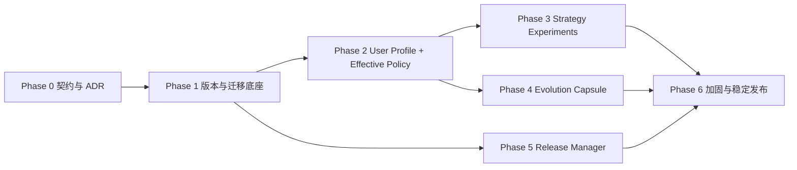

# AtomLearn 自进化 v2 详细实施方案

| 项目 | 内容 |
| --- | --- |
| 文档状态 | Implementation in progress |
| 更新时间 | 2026-08-15 |
| 设计依据 | [自进化 v2 设计](SELF_EVOLUTION_V2_DESIGN.md) |
| 发布策略 | 默认关闭新能力，逐阶段启用，不一次性替换 v1 |

## 实施状态

| Phase | 状态 |
| --- | --- |
| Phase 0：契约、ADR 与威胁模型 | Implemented |
| Phase 1：版本与迁移底座 | Implemented |
| Phase 2：User Profile 与 Effective Policy | Implemented |
| Phase 3：Strategy Experiments | Complete |
| Phase 4：Evolution Capsule | Complete |
| Phase 5：Release Manager | Complete |
| Phase 6：加固与稳定发布 | Planned |

## 1. 交付目标

本计划把 v2 拆成六个可独立验收的阶段。每个阶段都必须保持现有 workspace-local adaptation、course evolution、RAG、考试、科研和 Atom 状态机向后兼容。

建议顺序：



Phase 1 是所有后续能力的基础。Phase 3、4、5 可以在 Phase 2 稳定后部分并行，但正式发布必须在 Phase 6 汇合。

## 2. 全局工程约束

### 2.1 不变量

所有实现和测试必须继续保证：

- 同一课程最多一个 Active Atom；
- 非 Active Atom 不能写 mastery Evidence；
- mastered 必须有持久化 Evidence；
- prerequisites 在激活前满足；
- RAG grounding、引用和 coverage 不能被个性化关闭；
- 当前轮明确要求优先于历史偏好；
- 运行时不能应用 `patch_skill`；
- 不永久删除学习、画像、实验或迁移历史；
- Core Skill 学习运行时只读；
- 不存储原始聊天、自由文本画像或敏感属性。

### 2.2 默认 feature flags

首个包含 v2 代码的 release 中，建议全部默认关闭：

```yaml
features:
  global_personalization: false
  strategy_experiments: false
  capsule_export: false
  release_manager: false
```

workspace-local adaptation 和现有 `evolve` 保持原行为。feature flag 不能关闭 protected invariants。

### 2.3 依赖选择

- 使用 `platformdirs` 解析用户数据目录；
- 继续使用 PyYAML 和 JSON Schema；
- 文件 mutation 使用原子写、revision 和明确文件锁；
- migration 由普通 Python 纯函数实现，不调用模型；
- release artifact 验证优先采用标准哈希和可审计签名方案；
- 测试不得依赖真实用户目录、真实 GitHub release 或外网。

## 3. 建议模块与资源布局

以下是实施时的目标，不在本次文档阶段创建：

```text
atom-learn/
├── scripts/
│   ├── atomlearn.py                  # 注册 profile/policy/strategy/capsule 命令
│   ├── userstore.py                  # platformdirs、profile scope、锁与原子事务
│   ├── effective_policy.py           # 纯合并器与 provenance
│   ├── migrations.py                 # registry、plan、copy、validate、switch
│   ├── strategy.py                   # 候选、暴露、监测、晋升、暂停
│   └── capsule.py                    # schema builder、privacy lint、export
├── assets/
│   ├── schemas/
│   │   ├── user-profile.schema.json
│   │   ├── user-strategy.schema.json
│   │   ├── effective-policy.schema.json
│   │   ├── strategy-experiment.schema.json
│   │   ├── evolution-capsule.schema.json
│   │   └── core-manifest.schema.json
│   └── templates/
│       ├── user-profile-state.yaml
│       ├── user-strategy-state.yaml
│       └── strategy-experiment.yaml
└── references/
    ├── USER_PROFILE.md
    ├── EFFECTIVE_POLICY.md
    ├── STRATEGY_EXPERIMENTS.md
    ├── MIGRATIONS.md
    └── EVOLUTION_CAPSULE.md

manager/                               # 与 course runtime 隔离的稳定管理器
├── atomlearn_manager/
│   ├── manifest.py
│   ├── verify.py
│   ├── install.py
│   ├── activate.py
│   └── rollback.py
└── tests/

tests/
├── fixtures/migrations/
├── fixtures/releases/
├── test_userstore.py
├── test_effective_policy.py
├── test_migrations.py
├── test_strategy.py
├── test_capsule.py
└── test_manager.py
```

如果仓库在实施前改为真正的 `atomlearn` package，应按包结构放置这些模块；不要继续增加容易与第三方包重名的顶层 py-module。

## 4. Phase 0：契约、ADR 与威胁模型

### 4.1 目标

在写状态代码之前冻结 scope、优先级、版本语义、隐私边界和 updater 信任模型，避免后续 schema 反复变化。

### 4.2 工作项

1. 为以下决策建立 ADR：
   - Core runtime 只读；
   - profile 与 strategy 分离；
   - workspace-local 默认、global opt-in；
   - Effective Policy 字段级优先级；
   - migration 纯函数；
   - manager 与 course runtime 隔离；
   - Capsule 不等于遥测。
2. 完成五份 JSON Schema 初稿：user profile、user strategy、effective policy、experiment、capsule。
3. 定义 Core manifest 的 namespace read/write compatibility。
4. 定义 threat model：
   - 恶意或损坏的 release；
   - path traversal、symlink/reparse-point 逃逸；
   - 并发 mutation 和 stale revision；
   - Capsule 重识别；
   - 降级后旧 Core 写新 schema；
   - 模型把原始消息塞进未知字段。
5. 建立 v1 fixture 快照：空 workspace、带 adaptation 的 workspace、带 evolution proposal/experiment 的 workspace、考试/科研/RAG 已初始化 workspace。
6. 明确所有 feature flags 和默认值。

### 4.3 验收标准

- 每种规范状态都只有一个负责写入的模块；
- Schema 对未知字段使用 `additionalProperties: false`；
- 版本字段含义无歧义，并有 upgrade/downgrade 示例；
- threat model 对每项风险指定测试或运行时守卫；
- v1 fixtures 可由当前 `0.12.0` 完整验证；
- 尚未改变任何用户运行行为。

### 4.4 参考工作量

2–3 个工程日。该估算用于拆分，不是交付承诺。

## 5. Phase 1：用户数据目录、Core 版本与迁移底座

### 5.1 目标

先解决“数据放哪里、谁能写、怎样迁移、失败怎样恢复”，暂不启用跨课程个性化。

### 5.2 工作项

#### A. Core version manifest

- 构建时生成不可变 Core manifest；
- 将 `pyproject.toml` 版本、Skill metadata 和 manifest 版本做一致性测试；
- 暴露只读 `atomlearn version --json`；
- status 输出当前 Core version 和各 namespace schema version。

#### B. User data root

- 实现 `platformdirs` 默认路径；
- 支持测试专用 `ATOMLEARN_DATA_DIR`；
- 拒绝相对覆盖路径；
- 创建目录时使用最小必要权限；
- 不扫描或自动导入其他目录；
- 通过 dependency injection 让测试完全使用临时目录。

#### C. Versioned state envelope

- 为新 namespace 实现统一 envelope validator；
- 支持 `created_by_core_version`、`last_written_by_core_version`、`min_reader_core_version`；
- 将 revision 与 schema version 分开；
- 禁止不兼容 Core 写入状态。

#### D. Migration registry

建议接口：

```python
register(namespace="user_profile", from_version=1, to_version=2, migrate=migrate_profile_v1_to_v2)
plan = migration_engine.plan(core_manifest, state_catalog)
result = migration_engine.apply(plan, transaction_root)
```

- 只允许连续、无歧义的迁移链；
- 对副本执行，不就地覆盖；
- 每一步后运行 namespace schema；
- 全部完成后运行跨 namespace 验证；
- 迁移日志只保存版本、哈希和错误代码；
- 失败副本保留供诊断，旧状态继续服务；
- 提供 `plan`、`validate` 和 dry-run，实际 apply 暂不对普通用户开放。

#### E. Concurrency

- namespace 单独 revision；
- mutation 使用 expected revision；
- 进程级文件锁覆盖 plan 到 commit；
- 原子 rename 前确认源和目标位于同一 volume；
- crash recovery 能识别未完成 transaction。

### 5.3 建议 CLI

```text
atomlearn version --json
atomlearn migrate status
atomlearn migrate plan [--workspace <path>]
atomlearn migrate validate [--workspace <path>]
```

本阶段不开放 `migrate apply` 给课程 harness；它只供后续 manager 调用。

### 5.4 测试

- Windows、Linux 的数据目录解析；
- override 相对路径和 workspace 内逃逸路径拒绝；
- envelope 缺失、未知字段、未来 schema、旧 reader 拒绝；
- v1 -> v2、跨两级迁移、缺失中间迁移；
- 重复迁移幂等或明确拒绝；
- 中途异常、磁盘写失败、验证失败后的旧状态可用；
- 两进程 stale revision 和锁竞争；
- Core version 三处不一致时 CI 失败。

### 5.5 验收闸门

- 当前 91 项测试全部通过；
- migration fixture 100% 通过；
- 未启用新 feature 时用户目录不会被创建；
- 学习流程不会写 Core 目录；
- 迁移失败不会改变 active state；
- `git diff` 型只读测试证明学习 session 后 Core tree 无变化。

### 5.6 参考工作量

5–7 个工程日。

## 6. Phase 2：User Profile 与 Effective Policy

### 6.1 目标

提供显式、可查看、可暂停的跨课程偏好，并把 Core、用户、课程和当前轮要求合并为可解释策略。

### 6.2 工作项

#### A. Profile lifecycle

- 创建默认 profile，但只有 opt-in 后才写跨课程信号；
- workspace 绑定 profile ID，默认可为 `none`；
- global opt-in 与 strategy experiment opt-in 分开；
- 支持 `enable`、`disable`、`status`、`show`、`export`、`retire`、`reset-plan`；
- reset 使用可恢复方式，不永久删除 ledger；
- 不自动迁移旧 workspace 信号。

#### B. Scope-aware signal extraction

扩展 observation payload：

```yaml
session_id: session-opaque-001
context: teaching
scope: workspace
signals:
  - dimension: explanation.order
    value: example_first
    direction: prefer
    evidence: explicit
    reason_code: explicit_request
    confidence: 0.95
    turn_refs: [turn-opaque-9]
```

- `scope: workspace` 保持默认；
- `scope: user` 要求 global opt-in；
- 同一 observation 由一个 scope 写入；
- 提供显式 `promote-preference`，把选定的 active explicit preference 复制成新的 user-scope 事件并保留来源引用；
- inferred workspace preference 不允许一键提升为 global active，必须重新积累 user-scope 支持或由用户明确确认。

#### C. Effective Policy merger

- 实现无 I/O 的纯合并函数；
- 每个字段返回 value、source、revision；
- 返回 ignored candidate 和 reason code；
- 应用 context allowlist；
- 当前轮 overrides 只存在内存，不写 profile；
- protected invariants 单独输出，不与普通 preference 同名；
- 生成稳定 fingerprint；
- 所有消费端使用合并器，不允许各自重新实现优先级。

#### D. Integration

- `status --json` 返回适用 Effective Policy 摘要；
- `adapt guidance` 兼容旧输出，并增加 provenance；
- research、exam、review、orientation 和 teaching 明确传入 context；
- 生成 `PERSONALIZATION.md` 时区分 workspace 与 user scope；
- 用户询问“你记住了什么”时可展示值、来源和作用范围。

### 6.3 建议 CLI

```text
atomlearn profile status [--profile default]
atomlearn profile enable --scope user
atomlearn profile disable --scope user
atomlearn profile show [--profile default] [--json]
atomlearn profile promote-preference <workspace> <dimension>
atomlearn profile retire <dimension> --scope user
atomlearn profile export --output <path>
atomlearn policy effective <workspace> --context teaching --json
atomlearn policy explain <workspace> <dimension> --context teaching
```

### 6.4 测试矩阵

| 场景 | 预期 |
| --- | --- |
| global 未 opt-in | 不写用户目录，不读取全局偏好 |
| current turn 与 global 冲突 | current turn 生效，global 出现在 ignored |
| workspace explicit 与 global explicit 冲突 | workspace 生效 |
| inferred 与 explicit 冲突 | explicit 生效 |
| research-only 值进入 teaching | 被 context filter 排除 |
| preference 请求弱化 mastery | invariant 拒绝并给 reason |
| global schema 不兼容 | 暂停 global，workspace 仍可运行 |
| 两个 workspace 使用同一 profile | revision 正确，无重复 session 计数 |
| 用户 disable global | 立即不再读取/写入，数据保留 |
| promote inferred preference | 未经显式确认不得直接 active |

### 6.5 验收闸门

- 默认行为与 v1 完全兼容；
- 每个生效值都可解释来源；
- 所有 ignored 候选都有稳定 reason code；
- 无 consumer 绕过统一合并器；
- 全局 profile 中没有自由文本和 workspace 路径；
- disable 后本轮行为立即恢复 workspace/Core 层；
- English/Chinese 用户视图含义一致。

### 6.6 参考工作量

6–9 个工程日。

## 7. Phase 3：低风险 Strategy Experiments

### 7.1 目标

让 AtomLearn 不只记住喜欢什么，还能保守验证哪种呈现策略对该用户更有效，同时避免伪因果和学习质量下降。

### 7.2 工作项

#### A. Candidate generation

- 只从 allowlisted strategy dimensions 生成候选；
- 候选引用聚合 Evidence/Review/Event ID，不复制内容；
- 明确 hypothesis、baseline、candidate、scope、eligible contexts、primary/guardrail metrics；
- 用户启用 experiments 前只保存 `candidate`，不分流教学。

#### B. Eligibility

- 低风险类型 allowlist；
- 不与 explicit preference 冲突；
- 不影响 mastery、DAG、skip、RAG 或 privacy；
- 有可观测 outcome；
- 有至少两个可比较层或预期样本路径；
- 通过 policy 和 schema 验证。

#### C. Exposure assignment

- 在 Atom episode 开始前写入不可变 exposure；
- 用 experiment/atom ID 确定性分配；
- 按 context、Atom type、difficulty、prior diagnostic、episode type 分层；
- 重试读取已有 exposure；
- 一个 episode 不允许中途换组；
- 用户本轮覆盖时记录 `overridden`，该 episode 不进入因果比较。

#### D. Outcome linkage

- Evidence 和 Review 只通过 opaque exposure ID 关联；
- 支持 delayed outcome 尚未到期的 `pending` 状态；
- 不把没有 exposure 的历史记录倒推为实验结果；
- promotion evaluator 读取质量、努力和 guardrail 指标；
- 数据不足保持 monitoring；质量恶化自动 `paused`，不回滚学习历史。

#### E. Promotion

- 预注册 primary metrics 和 thresholds；
- 至少 5 个 distinct 可比较 Atom，且至少 2 个 delayed outcomes；
- hard gates 全部为零；
- 主要质量指标不得恶化；
- 不能只因速度或满意度晋升；
- 输出局限性说明，不声称普适因果结论；
- active strategy 进入 Effective Policy，低于任何 explicit preference。

### 7.3 建议 CLI

```text
atomlearn strategy status [--profile default]
atomlearn strategy list [--status monitoring]
atomlearn strategy preview <experiment-id>
atomlearn strategy enable-experiments
atomlearn strategy pause [<experiment-id>]
atomlearn strategy exposure <workspace> <atom-id> --context teaching
atomlearn strategy monitor <experiment-id>
atomlearn strategy explain <experiment-id>
```

`exposure` 主要供 harness 调用；普通用户不应手工伪造结果。所有 mutation 支持 expected strategy revision。

### 7.4 测试

- 相同 Atom 重试得到相同 exposure；
- 不同层不会错误比较；
- explicit override 排除该次 exposure；
- 延迟结果未到时不晋升；
- 只有速度改善时不晋升；
- 质量 guardrail 恶化时暂停；
- 少于 distinct Atom 阈值时 insufficient；
- 同一 Evidence 不能关联两个 exposure；
- Core 更新删除枚举后 strategy 进入 `needs_review`；
- 用户暂停后 Effective Policy 不再读取 candidate；
- 无实验 opt-in 时不存在行为分流。

### 7.5 验收闸门

- 实验不会修改课程正确性状态；
- 所有教学暴露可重放且不可重复计数；
- promotion 结果能列出样本、指标、限制和 guardrail；
- 失败/暂停不覆盖 Evidence；
- 使用独立 fixture 验证 evaluator，没有用候选生成数据调参；
- 至少完成一轮 shadow mode，仅记录“若启用会如何分配”，不改变真实教学。

### 7.6 参考工作量

8–12 个工程日。

## 8. Phase 4：Evolution Capsule 与维护者闭环

### 8.1 目标

允许用户把本地发现转换为隐私最小化的产品候选，同时保证导出不等于上传、候选不等于产品结论。

### 8.2 工作项

- 定义严格 Capsule JSON Schema；
- 所有类别字段使用枚举；
- 指标使用聚合或区间分桶；
- 移除 profile/workspace/Atom/source 的稳定标识；
- 时间只保留粗粒度窗口；
- 为小样本、唯一组合和自由文本运行 privacy lint；
- 生成本地 Markdown/JSON 预览；
- 导出需要显式输出路径；
- 网络提交若未来实现，必须是独立命令和独立确认；
- 建立维护者端 schema validate、deduplicate、triage 和 fixture conversion 流程；
- 维护者不能从 Capsule 自动生成并合并代码。

### 8.3 建议 CLI

```text
atomlearn evolve capsule build <workspace> --proposal <id>
atomlearn evolve capsule lint <capsule-path>
atomlearn evolve capsule preview <capsule-path>
atomlearn evolve capsule export <capsule-path> --output <path> --confirmed
```

首版不提供 `submit`，只支持本地文件导出。

### 8.4 测试

- 原始消息、自由文本、绝对路径、URL、DOI、Atom title/ID 注入均失败；
- 未知字段失败；
- 小样本可重识别组合失败或被更粗分桶；
- lint 前不能 export；
- export 前无网络请求；
- build、preview、export 的 capsule hash 一致；
- capsule ID 每次导出为一次性 ID；
- 维护者 ingest 对重复 capsule 可确定性去重，但不依赖用户稳定 ID。

### 8.5 验收闸门

- 默认无上传、无后台 telemetry；
- 用户可看见完整导出内容；
- Capsule 无内容字段、稳定用户标识和本地路径；
- 维护者流程要求先建复现测试再修改 Core；
- 单个 Capsule 不会自动改变默认策略。

### 8.6 参考工作量

4–6 个工程日。

## 9. Phase 5：版本化 Release Manager

### 9.1 目标

安全安装不可变 release，在状态副本上迁移，健康检查后切换，并能恢复旧 Core。该能力独立于课程运行时。

### 9.2 架构选择

推荐稳定 bootstrap + side-by-side 版本目录：

```text
<manager-root>/
├── manager/
├── active.yaml
├── releases/
│   ├── 0.12.0/
│   └── 0.13.0/
├── staging/
└── transactions/
```

`active.yaml` 只包含当前版本、前一版本、manifest hash 和 transaction ID。课程 CLI 不能写该文件。

### 9.3 工作项

#### A. Release pipeline

- tag 必须与 package/Core manifest 版本一致；
- 构建不可变 artifact 和 manifest；
- 生成 hashes；
- 运行 Windows/Linux、Python 3.10–3.13 全量 CI；
- 运行 Skill validator、migration fixtures 和 manager upgrade tests；
- 仅在所有闸门通过后发布 stable artifact；
- 禁止 stable channel 指向 `main` 或可变分支压缩包。

#### B. Manager update transaction

- `check`：只读获取并验证 manifest；
- `plan`：列出 Core、schema、磁盘和 workspace 影响；
- `download`：写入暂存并校验 artifact；
- `verify`：防 zip-slip、非法链接、哈希错误、manifest/schema 不符；
- `migrate-copy`：调用 Phase 1 migration engine；
- `install`：写新版本目录，不覆盖旧版本；
- `activate`：更新稳定指针；
- `health-check`：运行新 Core validate/status/smoke tests；
- `commit`：标记 transaction 完成；
- `recover`：失败时恢复指针和升级前状态副本。

#### C. Windows considerations

- 不要求管理员权限创建 symlink；
- 避免替换正在执行的目录；
- 同盘暂存以支持原子 rename；
- 对 reparse point 做显式拒绝或安全解析；
- 被杀进程重启后能根据 transaction journal 恢复；
- 被占用文件导致切换失败时保留旧 active，不做半更新。

### 9.4 建议 Manager CLI

```text
atomlearn-manager version
atomlearn-manager update check [--channel stable]
atomlearn-manager update plan <version>
atomlearn-manager update apply <version> --confirmed
atomlearn-manager update status
atomlearn-manager update recover
atomlearn-manager rollback <version> --confirmed
```

普通 `atomlearn` 可提示存在更新，但不能自行执行更新。

### 9.5 测试

- manifest 版本、hash、签名策略不一致拒绝；
- zip-slip、绝对路径、链接逃逸、重复文件名拒绝；
- 下载截断、磁盘不足、权限失败；
- migration 中途失败；
- 新 Core smoke test 失败；
- active pointer 更新前/后进程被终止；
- Windows 文件占用；
- upgrade 0.12 -> 0.13、跨多个可迁移版本；
- downgrade 只恢复配套旧状态副本；
- stable channel 不接受 prerelease/main；
- 离线状态保持当前版本可用。

### 9.6 验收闸门

- 更新失败后旧 Core 和旧状态仍可验证、可运行；
- 更新期间 course runtime 无写 Core 权限；
- artifact 未验证前不会运行其中代码；
- 切换后 `atomlearn version`、Skill metadata 和 active manifest 一致；
- 至少保留一个可恢复版本；
- 恢复不会让旧 Core 写入不兼容的新 schema。

### 9.7 参考工作量

8–12 个工程日。

## 10. Phase 6：加固、灰度与稳定发布

### 10.1 Shadow rollout

1. 只启用 Effective Policy explain，不改变行为；
2. 比较 v1 guidance 与 v2 merge 结果；
3. 开启 workspace + global explicit preferences；
4. 开启 inferred profile，但保持 strategy shadow；
5. 对内部测试 profile 开启 experiments；
6. 开启本地 Capsule export；
7. 用模拟 release channel 验证 manager；
8. 最后才发布 stable manager/update channel。

### 10.2 全量质量门槛

- fast 与 integration 测试分层保持；
- Windows/Linux + Python 3.10–3.13；
- migration fixture 覆盖所有已发布 schema 边；
- property-based tests 覆盖 policy precedence、迁移幂等和非法输入；
- fault injection 覆盖 transaction 每个持久化点；
- privacy tests 覆盖自由文本、标识符和路径渗漏；
- replay tests 证明相同输入产生相同 Effective Policy fingerprint 和 exposure；
- backward compatibility tests 覆盖未 opt-in 的 v1 workspace；
- 文档中英文 README 链接和 CLI help 同步；
- Skill validator 通过，`agents/openai.yaml` 与能力描述一致。

### 10.3 发布闸门

进入 stable 前必须满足：

- 无 P0/P1 状态完整性或隐私问题；
- 至少两个版本迁移路径被端到端演练；
- manager 失败恢复在 Windows 和 Linux 均通过；
- strategy experiments 已完成 shadow 模式且未触发不变量偏移；
- Capsule privacy lint 有独立攻击夹具；
- 所有 feature 都可以单独关闭并安全退回 v1 行为；
- release notes 明确 schema、迁移、回滚和已知限制。

### 10.4 参考工作量

5–8 个工程日。

## 11. 数据契约草案

### 11.1 User profile state

```yaml
kind: atomlearn.user-profile
schema_version: 1
created_by_core_version: 0.13.0
last_written_by_core_version: 0.13.0
min_reader_core_version: 0.13.0
revision: 3
profile_id: default
global_enabled: true
policy:
  store_raw_messages: false
  infer_sensitive_traits: false
  behavioral_min_sessions: 2
preferences: {}
```

### 11.2 Strategy experiment

```yaml
kind: atomlearn.strategy-experiment
schema_version: 1
revision: 1
id: exp-example-first-001
scope: user
dimension: explanation.order
baseline: intuition_first
candidate: example_first
contexts: [teaching]
status: monitoring
strata:
  atom_types: [concept, procedure]
  episode_types: [new_learning]
metrics:
  primary: [first_transfer_score, delayed_review_score]
  guardrails: [misconception_recurrence, blocking_backtrack_rate]
minimums:
  distinct_atoms: 5
  delayed_outcomes: 2
```

### 11.3 Exposure

```json
{"id":"xps-000001","experiment_id":"exp-example-first-001","workspace_ref":"opaque-session-local","atom_ref":"opaque-experiment-local","arm":"candidate","context":"teaching","policy_fingerprint":"sha256:...","status":"exposed"}
```

`workspace_ref` 和 `atom_ref` 仅在本地实验 ledger 内有效，不能进入 Capsule。

### 11.4 Capsule

```yaml
kind: atomlearn.evolution-capsule
schema_version: 1
capsule_id: one-time-random-id
core_version: 0.13.0
failure_type: repeated_blocking_prerequisite
affected_feature: concept_routing
window: sessions_5_to_10
metrics:
  occurrence_bucket: 3_to_5
  mastery_attempt_delta_bucket: 1_to_2
candidate:
  type: routing_policy
privacy:
  raw_messages_included: false
  source_content_included: false
  stable_user_id_included: false
  local_paths_included: false
  lint_status: passed
```

## 12. Issue 拆分建议

每一项应独立 commit，并在依赖满足后推送：

1. `docs: freeze self-evolution v2 contracts and threat model`
2. `feat: add core manifest and version reporting`
3. `feat: add isolated user data store`
4. `feat: add deterministic migration engine`
5. `feat: add opt-in global learner profiles`
6. `feat: add explainable effective policy merger`
7. `feat: integrate effective policy across learning contexts`
8. `feat: add strategy experiment state and exposure ledger`
9. `feat: add conservative strategy monitoring and promotion`
10. `feat: add privacy-linted evolution capsules`
11. `feat: add versioned AtomLearn release manager`
12. `ci: add migration, fault-injection, and release fixtures`
13. `docs: publish self-evolution v2 operations and recovery guide`

每个 commit 至少包含对应单元测试；涉及状态写入、迁移或更新的 commit 还必须有端到端失败恢复测试。

## 13. 依赖关系与不可并行项

- Core manifest、state envelope 和 migration registry 必须先于 global profile；
- Effective Policy 必须先于任何 strategy experiment 行为分流；
- exposure ledger 必须先于 outcome evaluator；
- Capsule 可在 experiment schema 稳定后实现，但不得引用未冻结字段；
- Manager 可以与 strategy 并行开发，但不能在 migration engine 稳定前进入 apply；
- release signing/trust 决策必须在 manager 下载任何真实 artifact 前完成；
- 当前已有 `adaptation.py` 与 `evolution.py` 的兼容迁移不能由两个分支同时改写同一 schema。

## 14. 风险优先级

### P0

- 全局 profile 未 opt-in 仍被读取或写入；
- Core runtime 可修改安装目录；
- migration 失败覆盖原状态；
- 旧 Core 写入新 schema；
- Effective Policy 能覆盖 mastery/RAG/privacy invariant；
- Capsule 泄露原始消息、路径、资料 locator 或稳定用户标识；
- manager 在 artifact 验证前执行新代码。

### P1

- workspace 与 global preference 优先级不一致；
- exposure 重复计数或中途换组；
- 仅因速度提升自动晋升；
- update 失败后 active pointer 与状态版本不一致；
- Windows 文件占用造成半安装；
- schema 值移除后旧策略仍生效。

### P2

- 多设备 profile 同步；
- 更复杂的实验统计模型；
- 远程 Capsule 提交连接；
- 多 profile UI；
- release channel 的企业镜像和离线包管理。

## 15. 整体完成定义

实施完成不等于“命令可运行”。必须证明：

1. v1 workspace 在未 opt-in 时零行为变化；
2. 全局偏好可启用、查看、解释、暂停和迁移；
3. Effective Policy 对每个字段都有 provenance 和 ignored reason；
4. strategy experiment 不改变学习正确性，并能在不足或变差时停住；
5. Capsule 默认只在本地，导出前通过 privacy lint 和用户预览；
6. release manager 能从可信 artifact 安装、迁移、健康检查和恢复；
7. Core、user、workspace 和 product 四个权限域没有越权写入；
8. 全量测试、跨平台 CI、Skill validator、migration fixtures 和故障注入全部通过；
9. 所有新状态都具备 revision、schema、审计和明确的恢复路径；
10. 文档明确告诉用户哪些内容被记住、存在哪里、怎样停用、怎样恢复。

按单人串行估算，Phase 0–6 约 38–57 个工程日；若 manager/release signing 复用成熟基础设施，可明显缩短。建议先交付 Phase 0–2，验证跨课程 profile 与 Effective Policy 的真实价值，再决定是否开启策略实验和自动更新。
