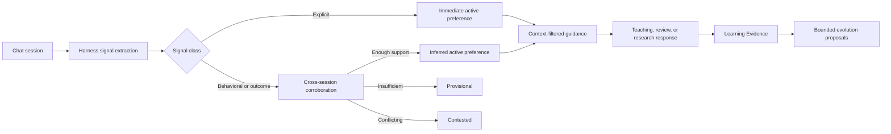

# Session-based self-adaptation design

## 1. Objective

AtomLearn should become better aligned with one learner across chat sessions without storing the conversation, inferring sensitive identity, or silently changing learning standards.

The design learns only bounded presentation preferences. It adapts how AtomLearn explains, structures, paces, demonstrates, questions, corrects, sources, and organizes research. It does not infer who the learner is or lower what counts as mastery.

## 2. Why adaptation has its own revision

Course, evolution, and session adaptation change at different rates:

- course revision protects learning state and Evidence;
- evolution revision protects hypotheses, proposals, approvals, and experiments;
- adaptation revision protects the learner preference signal ledger and derived profile.

Chat preferences may update every meaningful session. Sharing evolution revision would stale pending structural proposals whenever the learner changed response style. The independent adaptation revision prevents that coupling while retaining optimistic concurrency.

## 3. Architecture

The runtime never reads a remote chat transcript. The harness already participating in the conversation distills safe enum-only signals and invokes `adapt observe-session`. This makes the trust boundary explicit and testable.

## 4. Signal model

Each signal contains:

- an opaque session ID and optional opaque turn IDs;
- a known context;
- an allowlisted preference dimension and enum value;
- `prefer` or `avoid` direction;
- `explicit`, `behavioral`, or `outcome` evidence class;
- an evidence-specific reason code;
- bounded confidence.

There is deliberately no free-text field. Rejecting unknown fields prevents the harness from accidentally persisting a message, quote, session summary, secret, or personal identifier.

## 5. Activation algorithm

Explicit preference evidence activates immediately. Newer explicit preferences replace older values in the same dimension. An explicit rejection clears that value and suppresses older behavioral support until a later explicit preference re-enables it.

Behavioral and outcome evidence is aggregated at most once per distinct session. For each candidate value, the engine averages positive confidence and subtracts a bounded penalty for negative evidence. The value activates only when:

- at least two different sessions support it;
- confidence reaches the configured threshold;
- its margin over the second candidate is large enough.

Otherwise it remains provisional or contested and is not applied. This prevents one unusual task or one model interpretation from becoming a permanent style rule.

## 6. Context and precedence

Each dimension has allowed contexts. Research orientation cannot affect normal teaching or exam analysis; feedback style cannot alter field mapping or corpus statistics. Global response dimensions may apply across contexts, and exam guidance may adapt challenge presentation without changing computed difficulty or mastery thresholds.

Precedence is:

1. current-turn explicit request;
2. stored explicit preference;
3. corroborated inferred preference;
4. protocol default.

Task fitness remains a guard. A general concise preference does not prohibit a detailed derivation explicitly required by the task.

## 7. Two-lane self-evolution

Low-risk presentation adaptation is automatically usable after its activation rule passes. Its values are allowlisted, context-scoped, inspectable, reversible, and unable to modify course state.

High-impact changes remain proposal-only:

- mastery thresholds and dimensions;
- review intervals;
- prerequisite edges;
- Atom split or merge;
- Skill patches.

Learning outcomes produced under an adapted style become normal Evidence. The bounded evolution analyzer may then propose a monitored course-level change, but no preference signal directly authorizes it.

## 8. Privacy model

The engine enforces:

- no raw messages;
- no free-text preference rationale;
- no cross-workspace aggregation;
- no sensitive-trait inference;
- no identity or ability profiling;
- workspace-local state;
- retirement tombstones instead of silent history rewriting.

The learner can inspect `PERSONALIZATION.md`, correct a preference with newer explicit evidence, or retire a dimension from active guidance.

## 9. Failure modes and controls

| Failure mode | Control |
| --- | --- |
| One-off request becomes permanent | Behavioral inference needs two distinct sessions |
| Model invents a preference | Enum-only evidence class, confidence, corroboration, and inspection |
| Conflicting inferred preferences | Margin rule produces `contested`, not active |
| Old profile overrides current request | Current-turn explicit request has highest precedence |
| Research style leaks into teaching | Dimension-to-context filtering |
| Preference weakens learning rigor | Course invariants and mastery guards are non-overridable |
| Raw/private chat is persisted | Strict field allowlist; unknown fields rejected |
| Frequent sessions stale evolution proposals | Independent adaptation revision |
| Duplicate harness retry double-counts evidence | Session IDs are idempotency keys and duplicates are rejected |

## 10. Definition of done

Session adaptation is complete when:

- the harness reads guidance at session start or resume;
- it records a distilled observation once per meaningful session;
- explicit preferences activate immediately;
- inferred preferences need cross-session support;
- conflicts remain inactive;
- corrections and retirement work without deleting history;
- no raw chat or sensitive trait enters canonical state;
- course status exposes applicable guidance;
- evolution status exposes adaptation counts without sharing revisions;
- adaptation and workspace validation pass.
