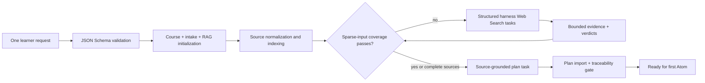

# AtomLearn start wizard design

## Outcome

The start wizard removes the accidental requirement that a first-time learner understand AtomLearn's internal intake, RAG, coverage, Web-evidence, and course-plan payloads. The learner supplies one topic phrase or one structured request; the harness and deterministic runtime perform the remaining turns through one resumable command.

## Architecture

The wizard calls the existing subsystem engines directly. Course, intake, and RAG files remain canonical. Its small `.atomlearn/start.yaml` checkpoint contains orchestration stage and task summaries only, so interruption recovery does not require replaying mutations.

## Design choices

- A public Draft 2020-12 JSON Schema makes the contract usable by forms, harnesses, editors, and tests.
- JSON and YAML share the same schema and runtime normalization.
- Deterministic IDs allow users to omit bookkeeping fields without sacrificing stable references.
- Relative files resolve from the payload location, matching normal manifest expectations.
- Outline strings become stable coverage IDs and a locatable inline outline source.
- Topic discovery sources are registered from provenance-checked Web evidence.
- The wizard does not fabricate a semantic course DAG. It returns an explicit harness plan task, then validates and imports the result through the canonical plan engine.
- The same command handles initial capture, corrective retrieval rounds, and final plan submission.

## Safety and consistency

Schema validation occurs before filesystem mutation. Existing manual workspaces are not converted implicitly. Coverage and plan imports retain their own revision and evidence gates. Private material is never copied into Skill assets or wizard checkpoints. All generated views are derived and may be regenerated from canonical state.

## Verification

Automated tests cover the shortest topic path, one-payload source initialization, resumable plan import, schema rejection before mutation, and schema printing. Subsystem RAG tests separately cover correction rounds and candidate-bound evidence.
