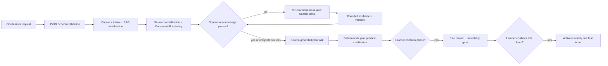

# AtomLearn start wizard design

## Outcome

The start wizard removes the accidental requirement that a first-time learner understand AtomLearn's internal intake, RAG, coverage, Web-evidence, and course-plan payloads. The learner supplies one topic phrase or one structured request; the harness and deterministic runtime perform the remaining turns through one resumable command.

## Architecture

The wizard calls the existing subsystem engines directly. Course, intake, and RAG files remain canonical. Its `.atomlearn/start.yaml` checkpoint contains the orchestration stage and exact current typed action, so interruption recovery replays work without replaying mutations.

## Design choices

- A public Draft 2020-12 JSON Schema makes the contract usable by forms, harnesses, editors, and tests.
- JSON and YAML share the same schema and runtime normalization.
- Deterministic IDs allow users to omit bookkeeping fields without sacrificing stable references.
- Relative files resolve from the payload location, matching normal manifest expectations.
- Outline strings become stable coverage IDs and a locatable inline outline source.
- Topic discovery sources are registered from provenance-checked Web evidence.
- The wizard does not fabricate a semantic course DAG. It returns an explicit harness plan task, then validates and imports the result through the canonical plan engine.
- Typed action and submission JSON Schemas bind harness work to action ID, wizard revision, and idempotency key. Stale submissions fail closed.
- The default console is bilingual and human-readable; `--json` exposes the complete harness protocol.
- The same command handles initial capture, corrective retrieval rounds, plan preview, phase confirmation, and first-Atom confirmation.

## Safety and consistency

Schema validation occurs before filesystem mutation. Existing manual workspaces are not converted implicitly. Coverage and plan imports retain their own revision and evidence gates. A plan preview does not import Atoms, and importing a confirmed plan does not activate its first Atom until a second confirmation. Private material is never copied into Skill assets or wizard checkpoints. All generated views are derived and may be regenerated from canonical state.

## Verification

Automated tests cover the shortest topic path, bilingual console, explicit assumptions and clarification, one-payload source initialization, exact action replay, typed plan/confirmation/activation submissions, stale-result rejection, schema rejection before mutation, and schema printing. Subsystem RAG tests separately cover correction rounds and candidate-bound evidence.
