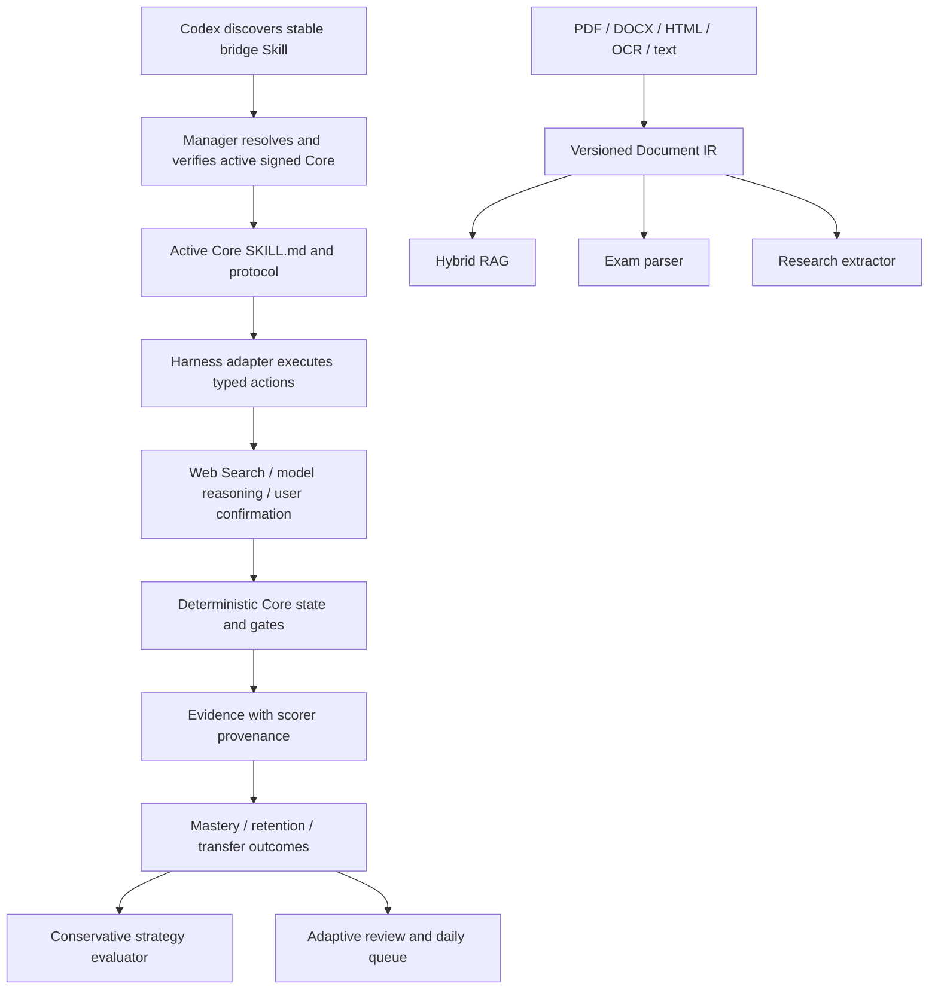

# AtomLearn v0.14 修复设计：从工程闭环走向可信学习效果

| 项目 | 内容 |
| --- | --- |
| 文档状态 | Proposed，尚未实施 |
| 基线 | AtomLearn Core `0.13.0`、Manager `0.1.0` |
| 日期 | 2026-08-15 |
| 目标版本 | `0.14.x`，具体拆分由实施阶段确定 |
| 北极星 | Understand -> Verify -> Master -> Retain/Transfer -> Advance |

## 1. 结论

Review 的主结论合理，应当采纳：AtomLearn 当前最紧迫的任务不是继续扩大功能面，而是证明两件事：

1. 更新之后，Codex 读取的教学协议、运行的 Core、依赖环境和信任根仍属于同一份经过验证的产品；
2. 系统记录的“掌握”和“策略变好”来自可观察、可校准、可重复的学习表现，而不是同一个模型对自己教学结果的循环评分。

这两项直接服务于 AtomLearn 的终极目标：把复杂知识变成可控的原子化学习路径，并且只在学习者真正掌握后推进。它们不是外围工程优化，而是产品语义的一部分。

Review 的大多数 P0/P1 建议应采纳，但有三处需要修正：

- 发布公钥是必要的可用性改进，却不能把“从同一个可能被攻破的下载渠道同时取得公钥和软件包”描述为完整信任；必须明确 pinned trust、TOFU 和多渠道核验的区别。
- 不分发或签名整个虚拟环境。虚拟环境含平台和绝对路径状态，不适合作为可移植发布物；应签名 Core wheel、依赖 wheelhouse、锁文件和环境配方，再由 Manager 为每个 Core 本地构造隔离环境。
- 不让 Core 内置另一套模型或 Web Search Agent。AtomLearn 是 harness-native Skill；Core 应持久化状态、验证协议和拒绝越级，harness 应执行模型推理和原生 Web Search。缺口应通过 typed orchestration contract 和固定桥接 Skill 补齐。

## 2. Review 逐项裁决

| Review 项 | 裁决 | 原因与修正 |
| --- | --- | --- |
| Manager 没有更新 Codex Skill | 采纳，P0 | 当前 Manager 只切换 Core 源码目录，Codex 仍可能读取复制到个人 Skills 目录的旧 `SKILL.md`。 |
| 发布官方公钥与指纹 | 采纳，P0 | 当前 release 没有可供普通用户初始化的公开 trust bundle；但同渠道下载只能提供便利或 TOFU，不能单独建立强信任。 |
| 每个 Core 独立运行环境 | 采纳，P0 | launcher 使用宿主 `sys.executable`；新增依赖可能造成新 Core 在旧环境中失败。实现方式改为签名 wheelhouse + 本地隔离环境。 |
| PDF/DOCX/OCR/RAG 更新后 smoke | 采纳，P0 | 当前 smoke 主要覆盖版本、帮助、迁移和 workspace 状态；真实解析与检索路径未执行。OCR 必须按 capability 声明验证。 |
| 模型自评形成循环验证 | 采纳，P0 | Evidence 的分数由 harness 提交，Core 只能验证格式和阈值，不能验证答案语义正确性；策略 outcome 又复用了这些分数。 |
| 只使用 required dimensions | 采纳，P0 | mastery 使用 required dimensions，但策略 outcome 当前平均所有数值维度，存在指标污染。 |
| 锚定题、迁移题、延迟保持题 | 采纳，P0 | 这是区分即时顺畅、真正掌握、保持和迁移的最小测量基础。 |
| 确定性判分优先 | 采纳，P0 | 选择题、数值题、可执行代码测试等不应优先交给生成模型自由评分。 |
| 开放题盲评/双评/人工校准 | 部分采纳 | 同一个模型重复两次不等于独立评审。必须记录 grader 身份与校准集；无法形成独立性时降级 Evidence 质量。 |
| 策略晋升加入置信区间和最小效应 | 采纳，P0 | 当前最小样本只是完整性下限，不足以支持效果声明。 |
| 一句话启动无 YAML | 采纳其用户目标，修正实现边界 | 用户不应处理 YAML；但 Core 不应直接持有模型或搜索凭据。采用可恢复 action protocol，由桥接 Skill 驱动 harness 逐步完成。 |
| 默认学习型本地 embedding | 部分采纳 | 增加可选学习型多语言 embedding；不静默下载大模型，不删除零依赖离线 fallback，也不再把哈希投影称为语义 embedding。 |
| HNSW、cross-encoder、parent-child | 采纳，P1 | 以 adapter、规模阈值和 benchmark gate 引入，不能成为所有小课程的强制依赖。 |
| RAG 默认阈值几乎总通过 | 采纳，P0/P1 交界 | 无阈值时应是 `report_only`，不能输出 `pass`；stable gate 必须引用命名 benchmark profile。 |
| 考试从 RAG source ID 导入 | 采纳，P1 | 需要先建立统一 Document IR；仅从检索 chunk 反推版面会丢失题号、表格和图像结构。 |
| 联合题目、答案、评分细则映射 | 采纳，P1 | 当前自动映射和难度主要依赖词面与启发式，联合证据更可靠。 |
| 自动难度分析 | 修正宣传与实现 | 文本启发式只能称为结构复杂度估计。只有官方锚点、作答率/区分度、耗时等数据才能支持经验难度。 |
| “泄题式记忆检测” | 部分采纳 | 实现题族近重复/变式检测和 held-out 同构题；不承诺从文本可靠判断用户是否“泄题式记忆”。 |
| 考试每日计划 | 采纳，P1 | 计划必须结合剩余天数、可用时间、Atom 缺口、先修和复习负荷，并在不可行时诚实报告。 |
| 科研主动发现和引用滚雪球 | 采纳，P1 | 当前只围绕已知 DOI 拉元数据。应增加研究协议、查询、筛选、前后向引用扩展和增量刷新。 |
| 复制 Elicit/Litmaps 能力 | Rebuttal | 不建设自有亿级论文库，也不复制完整竞品；只补齐可审计的 discovery -> screen -> read -> synthesize 闭环。 |
| 后台论文更新提醒 | 部分采纳 | 默认仅按需 `refresh`；后台网络和通知必须由用户显式启用 harness automation。 |
| FSRS 类调度 | 采纳为实验 adapter | Knowledge Atom 不是单张 flashcard。先建立每 Atom 的记忆状态和规范化复习事件，再用真实数据验证 FSRS 类模型。固定间隔继续作为 fallback。 |
| 真实学习效果 benchmark | 强烈采纳，P0 | 离线工程测试不能证明学习增益。必须分开工程 benchmark、评分校准集和用户学习效果研究。 |

## 3. 代码核查事实

以下问题已经从 `v0.13.0` 代码确认，不只是推测：

1. [`launcher.py`](../manager/atomlearn_manager/launcher.py) 使用 Manager 激活指针定位新版 Core 脚本，但不会改变 Codex Skills 目录中的教学协议。
2. launcher 通过当前 `sys.executable` 执行 Core，没有每版本依赖环境。
3. [`manager.py`](../manager/atomlearn_manager/manager.py) 的 smoke 覆盖 `version`、`--help`、migration/workspace validation 和 status，不覆盖真实文档解析、OCR、RAG 查询或课程恢复教学路径。
4. [`atomlearn.py`](../atom-learn/scripts/atomlearn.py) 的 mastery 决策只使用 Atom 声明的 required dimensions，这是正确的；但分数本身仍由 harness 提交。
5. [`strategy.py`](../atom-learn/scripts/strategy.py) 的 outcome 会平均 Evidence 中全部数值分数，而不是只读取 required dimensions；晋升使用均值差和很小的样本完整性下限，没有不确定性区间。
6. [`wizard.py`](../atom-learn/scripts/wizard.py) 会安全停在 `web_search_required` 或 `course_plan_required`，但闭环依赖调用它的 harness 继续执行任务。
7. [`rag.py`](../atom-learn/scripts/rag.py) 的默认向量是词/子词哈希投影，搜索时会扫描全部 active chunks；reranker 是可解释的词面/来源规则；`rag evaluate` 在没有阈值时默认允许所有指标通过。
8. [`exam.py`](../atom-learn/scripts/exam.py) 的 `process` 接受 UTF-8 文本或路径，以有限编号规则切题；映射和难度属于候选启发式。设计文档所述“RAG source 直接进入考试解析”尚未形成 CLI 闭环。
9. [`research.py`](../atom-learn/scripts/research.py) 已有 DOI/标题去重、元数据校验和外向引用获取，但 `fetch-metadata` 要求已知 DOI；跨论文主题仍主要依赖 token overlap。
10. 当前复习调度按课程统一使用 `1/3/7/30` 天，可通过 evolution 整体修改，但没有每 Atom memory state。

发布后独立验证还发现两个应并入修复范围的问题：

- 仓库为 Private 时，Manager 的无认证 GitHub Release URL 返回 `404`；`check` 把它表示为 offline，而 `plan` 随后可能触发内部断言。任何外部失败都必须转成稳定的 typed error，不能泄漏 `AssertionError`。
- 单独上传的 `gate-report.json` 是 pretty JSON，ZIP 内被签名绑定的是 canonical JSON；两者语义相同但字节不同。下一版应只生成一份 canonical bytes，再同时嵌入和上传。

## 4. 不可破坏的产品边界

所有修复必须继续满足：

1. 任一 workspace 最多一个 Active Atom；任何评测增强都不能绕过这个状态机。
2. 非 Active Atom 不能写 mastery Evidence；legacy migration 不能放宽此限制。
3. 用户的“懂了”“喜欢这种讲法”和交互顺畅不能单独成为 mastery。
4. 学习进度、题目状态、论文状态、检索状态和产品更新状态保持独立 revision。
5. harness 负责语言理解、教学表达和原生工具调用；Core 负责持久状态、schema、门禁、审计和确定性计算。
6. 私有教材、回答、题目和论文正文默认留在本地 workspace，不因 benchmark、实验或更新自动上传。
7. 所有自进化仍默认关闭、可解释、可回退；没有合格效果证据时只保持 monitoring。
8. 不把检索分数、模型置信措辞、引用次数、完成速度或满意度伪装成知识真实性。
9. 用户可以选择简单模式；学习型 embedding、cross-encoder、FSRS、后台刷新都不得静默启用。
10. 任何学习效果声明必须标注指标、时间窗口、对照、样本、缺失和不确定性。

## 5. 目标架构



这组边界解决四类耦合：

- bridge Skill 解决 Codex 教学协议与 active Core 的版本一致性；
- per-release runtime 解决 Core 与依赖版本一致性；
- Document IR 解决 RAG、考试和科研各自重复且不一致的文档解析；
- calibrated Evidence 解决 mastery、策略实验和复习调度共享不可信模型分数的问题。

## 6. Workstream A：更新、Skill、运行环境与信任闭环

### 6.1 固定桥接 Skill

在个人 Codex Skills 目录中安装一个由稳定 Manager 管理、内容很小、触发描述足够长期稳定的 `atom-learn` bridge：

```text
~/.codex/skills/atom-learn/
├── SKILL.md
├── agents/openai.yaml
└── .atomlearn-bridge.json
```

bridge 不复制某个 Core 的完整教学协议。它只执行以下安全流程：

1. 调用 `atomlearn-manager codex resolve --json`；
2. Manager 验证 active pointer、release manifest、签名和安装目录内容树；
3. 返回当前签名 Core 的 `SKILL.md` 绝对路径、Core 版本、protocol 版本和哈希；
4. harness 完整读取该 `SKILL.md` 及其直接引用的必要资源；
5. 若 Manager 验证失败，bridge fail closed，不回退到未验证源码。

建议命令：

```text
atomlearn-manager codex install [--codex-home <absolute-path>]
atomlearn-manager codex status
atomlearn-manager codex resolve --json
atomlearn-manager codex repair --confirmed
```

安全要求：

- 若目标目录存在且不含 Manager ownership marker，拒绝覆盖；
- bridge 更新采用新目录 + 原子替换，并保留前一份 bridge；
- 不在 bridge 中保存私钥、token、workspace 路径或用户数据；
- bridge 的 protocol 范围必须与 Core manifest 声明相交；
- Manager 更新失败时，旧 bridge + 旧 Core 仍可运行。

### 6.2 Release manifest v2

manifest v2 至少增加：

- `skill_protocol_version` 和 `skill_entrypoint_sha256`；
- `core_wheel`、base wheelhouse、lock/recipe 的文件名、大小和哈希；
- Python minor、OS、architecture 与 capability 声明；
- bridge protocol 的最小/最大兼容版本；
- smoke fixture bundle 哈希；
- trust bundle 版本和签名 key ID。

Core ZIP 继续作为可审计源码/Skill 资源包，但运行时不再直接依赖宿主环境中的 editable source。

### 6.3 每版本隔离环境

Manager 为每个 Core 构造：

```text
<manager-root>/
├── releases/<version>/
├── runtimes/<version>-py<minor>-<platform>/
├── wheelhouses/<version>/
└── active.yaml
```

流程为：

1. 验证签名 manifest 和所有 wheel/lock 哈希；
2. 创建新虚拟环境，不复用旧 Core 环境；
3. 使用 `--no-index` 和签名 wheelhouse 安装锁定依赖；
4. 记录安装后的 package inventory 与 recipe hash；
5. 使用新环境 Python 运行 smoke；
6. smoke 和状态副本迁移都通过后，原子切换 active pointer；
7. launcher 始终使用 active runtime 的 Python，而不是 Manager 自己的 `sys.executable`。

不签名整个 venv。签名的是可重建输入；本地环境是派生缓存，必须可验证、可重建、可回滚。

OCR 等系统依赖采用 capability 声明：未启用时可报告 unavailable；已启用或 release 宣称 supported 时，缺失即阻止激活。

### 6.4 信任初始化与密钥轮换

发布公开 `atomlearn-trust-bundle.json`：

```yaml
kind: atomlearn.trust-bundle
schema_version: 1
repository: panjose/Atom-Learn
keys:
  - key_id: release-2026-08
    algorithm: ed25519
    public_key: <base64-raw-key>
    fingerprint: sha256:<fingerprint>
    status: active
```

要求：

- repository、Release asset 和安装文档都提供相同指纹；
- Manager 清楚标记 `pinned`、`verified_tofu`、`unverified` 三种 trust level；
- release manifest 不能自行新增受信任 key；
- 正常轮换由旧 key 对新 trust bundle 签名，并保留重叠期；
- 私钥泄漏采用单独的 revocation/break-glass 流程；
- 文档不得暗示“HTTPS 下载同目录公钥”可以抵抗仓库账户完全失陷。

### 6.5 公有与私有 Release 下载

默认仍支持无需 token 的公开 GitHub Release。私有仓库增加显式 credential provider：

- token 只从环境变量、系统 credential store 或 GitHub CLI credential helper 读取；
- 不接受把 token 写入 manifest、URL、workspace 或命令行参数；
- Authorization 只发送给 allowlisted `github.com`/`api.github.com`，跨主机 redirect 必须剥离；
- 日志只记录 provider 和 HTTP 状态类别，不记录 header；
- `check`、`plan`、`apply` 对 401/403/404/offline 返回 typed error；任何网络失败不得触发断言。

### 6.6 更新后 smoke matrix

每个 release 在副本工作区中真实执行：

- bridge resolve 与 Skill/Core protocol 一致性；
- TXT、HTML、PDF 和 DOCX 小夹具提取；
- PDF/DOCX 表格与 locator；
- RAG init -> ingest -> search -> coverage；
- start 恢复、旧 workspace migrate/validate/status；
- optional OCR capability probe；
- exam/research 最小 source-to-state 路径；
- launcher 从隔离环境启动实际 active Core。

smoke 使用仓库自有或许可明确的小夹具，不读取用户真实文件。

## 7. Workstream B：可校准的掌握判断

### 7.1 Evidence 不是一个裸分数

Evidence v2 增加：

```yaml
measurement_kind: immediate_mastery | delayed_retention | near_transfer | far_transfer
assessment:
  method: deterministic | anchored_model | dual_blind | human | legacy_model
  grader_id: <versioned-non-secret-id>
  rubric_version: <id>
  calibration_set_version: <id-or-null>
  independent: true | false
  answer_hash: sha256:<local-answer-hash>
scores:
  explain: 0.0
  apply: 0.0
required_dimension_scores:
  explain: 0.0
  apply: 0.0
quality_tier: A | B | C | legacy
```

规则：

- mastery 和策略 outcome 只读取 Atom 声明的 required dimensions；
- 多余维度可保存用于诊断，但不能提高 pass average；
- self-report 只作为 UX 信号，不能进入 mastery；
- legacy Evidence 可继续恢复历史状态，但默认不能进入新的策略效果晋升；
- 原始回答留在本地可选 evidence store，长期状态至少保存 hash、必要摘要和评分 provenance；
- Capsule 继续禁止导出原始回答和题目文本。

### 7.2 Scorer registry

优先级从高到低：

1. exact/choice judge：选项、布尔、规范化短答案；
2. numeric/unit judge：容差、单位、等价形式；
3. code test judge：签名 test bundle、资源限制和结构化结果；
4. structured proof/derivation checks：仅验证可确定的中间约束，不宣称自动证明全部正确；
5. anchored model judge：使用版本化 rubric、参考答案和反例；
6. blind dual review：评分者不看到教学策略分组和另一个评分；
7. human calibration/adjudication。

如果两个评分来自同一个模型、同一上下文或共享未隔离的答案，它们必须标为 `independent: false`，不能包装成双盲证据。

### 7.3 锚定题与 held-out 测量

每个可参与效果实验的 Atom family 应声明：

- immediate mastery items；
- near-transfer items；
- far-transfer items（适用时）；
- 7/30 天或课程自定义延迟保持 items；
- 评分器、required dimensions、item family 和泄漏边界。

教学阶段不能把 held-out 答案或等价完整解法暴露给同一 episode。若 harness 无法提供上下文隔离，则 Evidence 降级，不用于策略晋升。

### 7.4 开放题校准

对开放题建立人工标注 calibration set，报告：

- 与人工评分的一致性；
- 各维度偏差与混淆；
- 语言、学科、难度和答案长度分层结果；
- grader/version 漂移；
- abstain 与需要人工复核的比例。

未达到 profile 阈值的 grader 可以给反馈，但不能独立触发 mastered 或策略晋升。

## 8. Workstream C：可信策略实验与真实学习效果

### 8.1 指标分层

永久分开三组指标：

| 指标层 | 示例 | 可否证明学习效果 |
| --- | --- | --- |
| UX | 满意度、偏好、对话中断、主观负担 | 否 |
| Process | 尝试次数、提示次数、完成时间、回溯率 | 单独不能 |
| Learning | 即时掌握、延迟保持、near/far transfer | 是，仍需校准评分和对照 |

速度只能作为成本或 guardrail；不能以更快完成为理由降低 mastery。

### 8.2 Outcome 资格

策略比较只接收：

- 在 exposure 后产生且属于同一 Atom episode 的 Evidence；
- measurement kind 和 scorer quality 满足预注册要求；
- required dimensions 完整；
- baseline/candidate 在同一可比较 stratum；
- 没有显式用户策略偏好干预；
- 延迟窗口真实到期，而不是把即时题标为 delayed。

### 8.3 保守统计门禁

每个实验预注册 primary metric、minimum effect、guardrail、分析窗口和停止规则。首版建议下限：

- 每 arm 至少 10 个可比较 outcome；
- 总计至少 20 个 distinct Atom episodes；
- 每 arm 至少 5 个合格 delayed outcomes；
- 主要质量指标的 95% 区间下界超过 minimum effect；
- guardrail 的不利区间上界不超过容忍阈值；
- 至少一个 transfer 或 delayed-retention 指标，而不仅是即时 mastery。

这些是拒绝过早晋升的 floor，不是“达到就证明因果”的充分条件。小样本个体实验长期处于 monitoring 是正常行为；低风险表达偏好仍可由用户直接设置，不需要伪造学习效果结论。

分析首选可重复的分层 bootstrap/permutation；产品聚合研究再使用层级模型处理 learner、Atom 和领域异质性。所有随机过程固定 seed 并保存 analysis version。

### 8.4 三层 benchmark

1. Engineering benchmark：schema、状态机、grader、RAG、更新、恢复；证明软件正确。
2. Calibration benchmark：有标准答案或人工标注的中英文多领域题；证明评分和检索在已知分布上的表现。
3. Learning-effect study：经同意的真实学习者、对照策略、延迟测量和迁移题；才可以支持“让用户学得更好”的声明。

真实学习报告至少包含：

- 即时掌握、7/30 天保持、near/far transfer；
- 完成率、退出率、总时间和提示负担；
- 对照条件、分配方式、样本量、缺失数据和区间；
- 领域与先验知识分层；
- 预注册偏离和不良体验。

不把私有学习内容自动汇总。研究数据必须独立 opt-in、最小化、可撤回，并通过新的 privacy attack fixtures。

## 9. Workstream D：无 YAML 的 harness 编排闭环

### 9.1 Typed action protocol

保留 Core 不直接调用模型/搜索的边界，但把“下一步”从自然语言提示升级为 schema 化 action：

```yaml
kind: atomlearn.workflow-action
schema_version: 1
action_id: action-...
workflow_revision: 3
stage: evidence_discovery
action: web_search
display:
  zh_CN: 正在查找权威资料
  en: Finding authoritative sources
tool_contract:
  capability: harness.web_search
  queries: []
submission_schema: <schema-id>
idempotency_key: <hash>
```

稳定 action kinds：

- `clarify_goal`；
- `inventory_sources`；
- `web_search`；
- `judge_coverage`；
- `generate_course_plan`；
- `validate_plan`；
- `confirm_phase`；
- `activate_first_atom`；
- `done`。

### 9.2 Bridge adapter loop

bridge Skill 必须：

1. 显示人类可读进度，不把 YAML 暴露给普通用户；
2. 每次只领取一个 action；
3. 调用 harness 原生工具；
4. 按 submission schema 回传结果；
5. 让 Core 验证 revision、coverage、来源和计划；
6. 失败时从相同 action 恢复，不重复写状态；
7. 在第一学习阶段前请求一次聚合确认，而不是要求用户确认每个内部文件。

CLI 的 `--json` 面向 adapter；默认 console 输出阶段、原因和可操作建议。Core 永远不接受“harness 已经完成”这种无结构声明来跳过 gate。

### 9.3 更好的 topic intake

默认目标不再只是 `Learn <topic>`。topic-only 首轮生成可编辑 assumptions：

- 使用目的：理解、应用、考试、科研导向；
- 目标深度；
- 已有基础；
- 时间范围；
- 成功标准。

若缺失会显著改变路线，只问 1–3 个高价值问题；否则使用清楚展示的默认值继续。用户一句话仍能启动，但不会在不知情时锁定错误目标。

## 10. Workstream E：统一 Document IR 与生产级 RAG

### 10.1 Document IR

所有文档解析先生成版本化、可审计的中间表示：

```yaml
source_id: calculus-book
source_revision: 2
blocks:
  - block_id: b-...
    kind: heading | paragraph | list | table | cell | formula | figure | image | ocr_text
    parent_id: b-parent
    page: 12
    bbox: [x0, y0, x1, y1]
    reading_order: 37
    locator: page 12, table 2, row 3
    extraction_method: pdf_text | pdfplumber | docx_xml | html_dom | ocr | vision_harness
    confidence: 0.92
```

RAG chunks、考试题目和科研 evidence extraction 都引用 block IDs。这样可以保留多栏顺序、表格关系、公式、图像区域和抽取置信度，而不是让三个子系统重复解析文件。

### 10.2 检索层级

- `hashed_lexical_v1`：零下载、确定性 fallback，明确称为 hashed lexical projection；
- `learned_local`：用户明确启用的多语言 embedding adapter，记录模型、revision、license、维度和文件 hash；
- `provider`：harness/provider embedding，继续要求 workspace profile 一致；
- `bruteforce`：小索引；
- `hnsw`：超过规模阈值后使用的持久向量索引；
- `deterministic_reranker`：离线 baseline；
- `cross_encoder`：可选 learned reranker，必须通过 benchmark 并保留分数 provenance。

不得静默下载模型。模型切换创建新 index generation；旧索引不与新向量空间混用。

### 10.3 Parent-child retrieval

细粒度 child block 用于召回，返回结果扩展到受 token budget 限制的 section/table parent。Evidence 仍引用真正提供支持的 child locator，不能只引用宽泛父章节。

### 10.4 规模与生命周期

- dense search 不再每次 materialize 全部 active chunks；
- HNSW 保存 chunk ID，SQLite 保存权威元数据；
- source revision 产生 tombstone，并在阈值后确定性 rebuild；
- index header 绑定 model/profile、chunk schema、source revision set 和 content hash；
- 崩溃时旧 index generation 继续可读，新 generation 未验证前不激活。

### 10.5 强制 benchmark profile

`rag evaluate` 行为改为：

- 无 thresholds/profile：输出 metrics + `quality_gate: report_only`；
- 指定 profile：按版本化阈值 pass/fail；
- stable CI：必须指定产品自带 profile，禁止 `report_only`。

benchmark 至少分为：教材、科研论文、题库；中文、英文、跨语言；公式、表格、OCR、多栏、跨章节、同义表达和全局问题。增加 source diversity、freshness、correction success 与 residual gap 指标，使实现与 [`RAG_DESIGN.md`](RAG_DESIGN.md) 的声明一致。

## 11. Workstream F：考试可靠性与每日计划

### 11.1 Source-to-exam

新增：

```text
atomlearn exam process-source <workspace> --source-id <id>
```

它读取当前 RAG source revision 对应的 Document IR，而不是复制全文到 exam state。题目、答案和评分细则分别声明 locator 范围；系统可以自动提出关联，但保存候选、依据和置信度。

### 11.2 解析与复核

- 支持多栏 reading order、主/子题树、跨页题目、表格、公式和 figure block；
- 编号规则只是一个 signal，不再是唯一边界；
- 解析失败或边界冲突进入 review queue，不把整份试卷当一道题；
- question/answer/marking 关联同时使用题号、版面、术语和分值一致性；
- Atom mapping 使用题干 + 标准答案步骤 + rubric criteria 对 Document IR/RAG 进行联合检索；
- 自动结果始终保留 `proposed/confirmed/corrected/rejected` 状态。

### 11.3 分开复杂度与难度

输出改为：

- `structural_complexity`：概念数、推理步、执行负担、图表/公式等启发式；
- `official_difficulty`：官方标注；
- `empirical_difficulty`：有足够作答数据时估计的正确率、区分度、耗时或 IRT 参数；
- `effective_difficulty`：按明确优先级选择，并标注来源和不确定性。

没有官方或经验数据时，产品只说“复杂度估计”，不说可靠自动难度。

### 11.4 题族与记忆风险

对往年题做规范化 fingerprint、语义相似和解题结构比较，形成 item family。用 held-out 同构变式检查迁移；若只会复现见过的表面形式，标记 `memorization_risk`。这不是作弊检测，也不对用户动机作判断。

### 11.5 每日计划

计划输入增加：

- target date；
- 每周可学习日和每天分钟数；
- 新 Atom、复习、题目练习的预计耗时；
- desired retention / final review window；
- 当前 backlog、Evidence gap 和先修链。

输出每天的 learn/remediate/review/practice 数量和预计耗时。若在不降低 mastery 门槛的前提下无法完成，输出 `infeasible`、缺口和可选调整，而不是生成虚假可行计划。

## 12. Workstream G：科研发现、筛选与证据综合

### 12.1 Research protocol

在 discovery 前持久化：研究问题、范围、日期、语言、文献类型、纳入/排除标准、目标结果和搜索限制。协议 revision 与 paper graph revision 分开。

### 12.2 Discovery adapter

新增 `research discover` action contract，支持：

- Crossref/OpenAlex bibliographic query；
- harness Web Search 与可选连接器；
- 已知 seed paper 的 backward/forward citation expansion；
- query/date/provider/filters/result IDs 的可复现日志；
- DOI/title/version family 去重和 metadata verification。

AtomLearn 不维护自己的亿级论文索引。provider 返回候选，Core 负责规范化、筛选日志、状态、引用图和审计。

### 12.3 Screening state

候选状态：`candidate -> screening -> included | excluded | needs_review`。每次排除必须对应预声明 criterion 和理由；模型建议不能静默成为最终排除。输出 PRISMA 风格计数，但不在不完整检索时声称系统综述完整性。

### 12.4 Citation snowball 与增量刷新

- backward：解析 references；
- forward：使用 provider cited-by 能力；
- 每轮记录 seed、depth、时间范围和停止规则；
- `research refresh` 对保存的查询和 included paper 检查新增/更新/retraction metadata；
- 默认按需运行；自动提醒必须用户显式启用外部 automation。

### 12.5 结构化抽取和综合

从 Document IR 提取：研究对象、setting、数据集、方法、baseline、outcome、effect/uncertainty、限制和 claim locator。表格/figure 抽取必须保存 block/region locator、方法和置信度；无法解析图像时请求 harness vision，不猜数值。

跨论文综合不再仅按 token overlap 聚类。先用结构化 facet 和可选 embedding 提出 theme，再由 harness/用户确认 merge。条件性矛盾必须保留 population、dataset、metric、assumption 和实验设置差异；每个综合 claim 都要有句子、表格或 figure 级 evidence locator。

## 13. Workstream H：每 Atom 自适应复习

### 13.1 Memory state

每个 Atom 增加独立派生状态：

```yaml
scheduler: fixed | adaptive
stability_days: 6.2
retrievability: 0.87
difficulty: 5.4
desired_retention: 0.90
last_qualified_review_at: ...
model_version: atomlearn-memory-v1
```

只有合格的主动提取 Evidence 更新记忆状态。阅读、被动重看、满意度和单纯对话时长不算成功 recall。

### 13.2 Review event normalization

Knowledge Atom 可能需要多个维度，因此一次 episode 先形成规范化结果：正确性、required-dimension minimum、提示次数、是否延迟、响应时间 bucket 和 scorer quality。响应时间只作辅助 signal，不能单独降低难度或延长间隔。

### 13.3 调度模式

- fixed：保留 `1/3/7/30` 和课程 override；
- adaptive-shadow：计算 memory state 和建议日期，但不改变队列；
- adaptive-active：benchmark 与用户 opt-in 后生效；
- exam objective：围绕目标日期和 final review window；
- long-term objective：围绕长期 desired retention。

FSRS 类实现作为 adapter 候选，不直接照搬 flashcard rating。需要先证明规范化 Atom review event 与模型假设兼容；训练数据不足时使用已验证默认参数或继续 fixed。

### 13.4 每日队列

统一队列包含：到期复习、失败补救、阻塞先修、新 Atom 和考试练习。调度器考虑预计时间、认知负荷、先修、延期和用户可用日；落后时重排但不伪造完成，也不删除逾期历史。

## 14. 实施阶段与提交策略

每个 Phase 使用一个主 commit，完成测试和文档同步后立即推送。若 Phase 内出现独立安全热修，使用单独 hotfix commit，不把多个已知风险揉成一个不可审计提交。

### Phase 0：契约真实性与已知发布缺陷

- 修复 private release typed errors 和 `plan` 断言；
- canonical gate report 只生成一次；
- 建立 capability/implementation ledger，阻止设计文档超前宣称；
- 将 `rag evaluate` 无阈值结果改为 `report_only`；
- 策略 outcome 只读取 required dimensions。

退出条件：所有失败为稳定错误；文档、CLI help、schema 和实际能力一致。

### Phase 1：完整更新闭环

- trust bundle、指纹、轮换协议；
- bridge Skill 与 `manager codex` 命令；
- manifest v2、签名 wheelhouse 和 per-release runtime；
- capability-aware smoke matrix；
- 公有/私有 Release 下载。

退出条件：更新后 bridge/Core/runtime/manifest 四者一致；任一点失败都保留旧版本可运行。

### Phase 2：Evidence 与测量基础

- Evidence v2、scorer registry、required-dimension enforcement；
- 锚定题、迁移题、延迟保持题 schema；
- deterministic grader 和开放题 calibration harness；
- legacy Evidence migration 与排除规则；
- learning benchmark protocol。

退出条件：模型自由分数不能单独进入高质量 outcome；grader 有可复现校准报告。

### Phase 3：策略实验可信化

- outcome eligibility；
- learning/UX/process 指标分离；
- 区间、最小效应、样本 floor 和停止规则；
- shadow replay 与 underpowered fixtures；
- 隐私安全的真实学习效果 opt-in 数据契约。

退出条件：小样本和仅即时/满意度改善永远不能自动晋升策略。

### Phase 4：Typed orchestration 与 Document IR

- workflow action schemas；
- bridge adapter loop 和无 YAML console；
- topic intake assumptions/clarification；
- PDF/DOCX/HTML/OCR Document IR；
- start/exam/research 对同一 IR 的消费契约。

退出条件：topic、source、outline 三条路径都能由 harness 从一句请求恢复到首个 Atom 确认，不要求用户编辑 YAML。

### Phase 5：语义与规模 RAG

实施状态（2026-08-16）：完成。默认小语料继续使用零 provider 路径；学习型本地模型必须显式批准，USearch HNSW 使用可恢复 generation 与 native 健康探测，cross-encoder 必须通过可移植的命名 benchmark report。内置 `core-multidomain-v1` 覆盖教材、科研、考试、中英文/跨语言与公式、表格、OCR、多栏等结构。

- learned embedding adapter；
- HNSW generation、增量 rebuild；
- parent-child retrieval；
- optional cross-encoder；
- 产品自带的分域、多语言、多结构 benchmark profiles。

退出条件：小索引保持零依赖路径；大索引不全表 dense 扫描；stable gate 不能以空阈值通过。

### Phase 6：考试与科研自动闭环

- exam source ID、联合映射、复杂度/经验难度分离、题族和每日计划；
- research discovery、screening、citation snowball、refresh 和结构化综合；
- 人工复核队列、来源 locator 和失败关闭。

退出条件：自动结果明确是候选还是已验证；没有证据时不会声称可靠难度、穷尽检索或创新空白。

### Phase 7：自适应复习与效果试运行

- per-Atom memory state；
- fixed/adaptive-shadow/adaptive-active；
- FSRS-like adapter spike；
- 每日队列和考试可行性计划；
- 真实课程的 baseline/pilot 报告。

退出条件：adaptive 在 shadow benchmark 中优于或不劣于 fixed guardrails；没有足够证据时继续默认 fixed。

## 15. Release gates

下一 stable release 除现有 8 组 Windows/Linux × Python 3.10–3.13 测试外，必须新增：

- bridge resolves exact active Core Skill hash；
- per-release runtime dependency isolation 和 rebuild determinism；
- public key fingerprint/trust rotation fixtures；
- private/public Release transport fixtures；
- PDF/DOCX/RAG/exam/research smoke；
- grader adversarial/calibration fixtures；
- strategy underpowered、wide-CI、no-delayed、metric-leak rejection；
- Document IR golden fixtures；
- mandatory RAG benchmark profile；
- scheduler replay、cold-start 和 backlog/infeasible plan；
- README 中英文能力声明一致；
- release asset 与 ZIP 内 gate report byte-identical。

任何真实学习效果 metric 未达标时，可以发布工程修复，但 release notes 必须写明“尚无学习增益结论”，不能把软件测试通过转述为教学效果得到证明。

## 16. 明确不做

- 不让运行中的 AtomLearn 修改自己的 Python、`SKILL.md` 或发布密钥；
- 不把用户聊天或资料默认上传为训练/实验数据；
- 不内置一个绕过 harness 权限与原生 Web Search 的隐藏 Agent；
- 不静默下载 embedding、reranker、OCR 或 FSRS 模型；
- 不分发不可移植的预构建 venv；
- 不从同一下载目录的公钥制造虚假的强信任叙事；
- 不复制 Elicit 的论文语料库或 Litmaps 的完整产品；
- 不把启发式题目复杂度称为经验难度；
- 不用满意度、速度或单次模型评分证明掌握或学习增益；
- 不为了考试日期降低 prerequisite 或 mastery 门槛。

## 17. 研究依据与产品参照

- Roediger 与 Karpicke 的实验表明，主动提取相较重复学习更有利于延迟保持，但即时表现和延迟保持可能给出不同结论：[Test-Enhanced Learning](https://www.psychologicalscience.org/journals/psychological-science/j.1467-9280.2006.01693.x/)。
- Karpicke 与 Blunt 报告检索练习在其科学文本实验中优于概念图式的精细学习；本设计把它作为主动提取与迁移测量的依据，而不是把任意考试等同于有效学习：[Science/PubMed](https://pubmed.ncbi.nlm.nih.gov/21252317/)。
- Cepeda 等发现合适的复习间隔会随目标保持期限变化，支持从统一 `1/3/7/30` 走向目标相关调度：[PubMed](https://pubmed.ncbi.nlm.nih.gov/19076480/)。
- RemNote 的官方说明展示了考试日期、每日目标、补欠期、最终复习期和落后重排如何形成用户可见计划；AtomLearn 借鉴调度问题，不复制其 flashcard 产品模型：[Preparing for an Exam](https://help.remnote.com/en/articles/9101991-preparing-for-an-exam)。
- Elicit 的官方工作流把问题/协议、检索、可审计筛选、结构化抽取和逐句引用综合连接起来；AtomLearn 只采用可审计闭环原则：[Systematic Literature Reviews](https://elicit.com/solutions/literature-review)。
- Litmaps 的官方说明展示 citation/reference 图如何支持相关文献发现与阅读优先级；AtomLearn 只实现 provider-neutral citation snowball 与内部 paper graph：[Litmaps visualization](https://docs.litmaps.com/en/articles/9181490-use-and-edit-litmaps-visualization)。
- Crossref REST API 官方文档确认 works endpoint 支持 query/filter 和开放元数据访问，因此 research discovery 不必局限于已知 DOI lookup：[Crossref REST API](https://www.crossref.org/documentation/retrieve-metadata/rest-api/)。
- FSRS 的开源实现将记忆建模为 stability/retrievability/difficulty 并支持按复习历史优化；本设计将其保留为需 benchmark 的 adapter，而不是未经验证的默认真理：[Open Spaced Repetition fsrs-rs](https://github.com/open-spaced-repetition/fsrs-rs)。

## 18. 最终验收定义

这轮修复完成，不是指命令数量更多，而是以下陈述都可由测试或数据证明：

1. Codex 读到的教学协议与 Manager 激活并验证的 Core 完全一致；
2. 新 Core 在自己的锁定环境中运行，旧 Core 和状态副本可恢复；
3. 普通用户可以验证官方公钥指纹，并理解其 trust level；
4. 从一句话、资料、题库或研究问题开始时，用户不需要编辑 YAML；
5. RAG 的语义能力和规模有命名 benchmark，而不是空阈值 pass；
6. mastery 记录说明题目类型、评分器、required dimensions、校准和证据质量；
7. 策略只有在合格 delayed/transfer outcome 和保守不确定性门禁下才晋升；
8. 考试输出区分候选映射、结构复杂度和经验难度，并能生成诚实的每日可行性计划；
9. 科研流程从问题走到可审计筛选、阅读图、证据综合和按需更新；
10. 自适应复习不能在没有真实效果证据时取代 fixed fallback；
11. 产品公开声明清楚区分“工程可靠”“评分校准通过”和“真实学习增益得到支持”。

只有到这一步，AtomLearn 才不仅是“不会乱改状态”的可靠 Skill，也开始成为“能够对学习效果负责”的完整学习系统。
