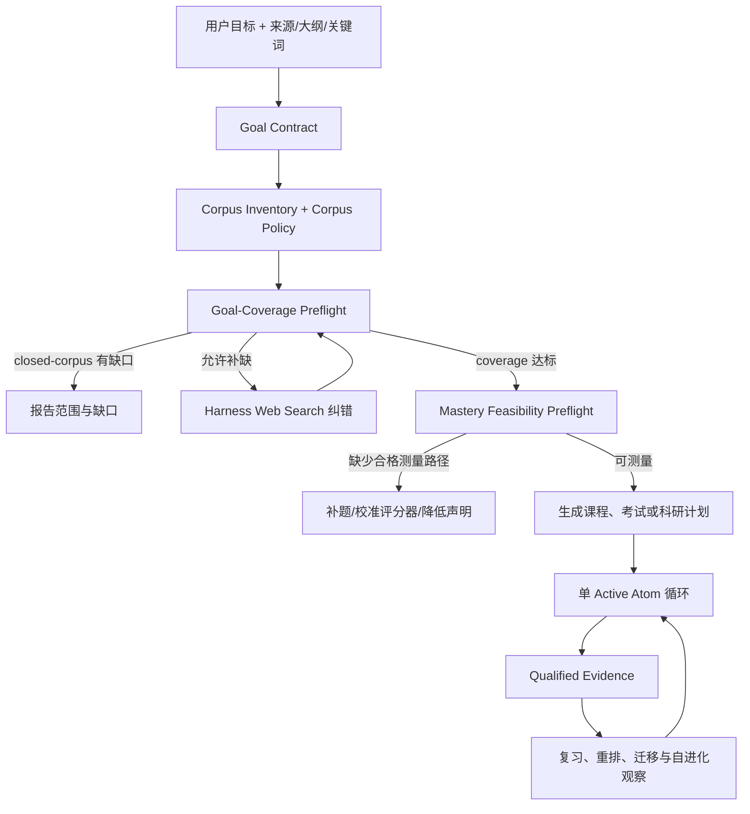

# AtomLearn v0.15 产品就绪修复设计

| 项目 | 内容 |
| --- | --- |
| 文档状态 | Proposed，尚未实施 |
| 审查基线 | AtomLearn Core `0.14.2`，Manager `0.2.2` |
| 日期 | 2026-08-17 |
| 目标版本 | `0.15.x`，确切版本在实施时按兼容性拆分 |
| 北极星 | Understand → Verify → Master → Retain/Transfer → Advance |

## 1. 结论

本轮 review 的总体判断合理：`v0.14.2` 已经建立了可信更新、状态安全、来源追踪、考试/科研工作流、保守自进化和自适应复习的工程骨架，但“有骨架”不等于“普通用户可以零配置获得可靠学习效果”。下一阶段不应继续横向堆功能，而应收紧四个产品真相：

1. 用户给了文件，不代表这些文件足以覆盖他的目标；任何 intake 模式都必须经过同一套来源—目标覆盖门禁。
2. 答对一道题，不代表同时具备解释、推导、应用和迁移能力；掌握结论必须由题型、评分器和证据维度共同约束。
3. 仓库中存在可选依赖，不代表稳定发布已经把这些能力交付给用户；能力声明必须与可安装、可验证、可回滚的运行环境一致。
4. 工程测试、模型行为评测和真实学习增益是三种不同证据；在完成人体学习研究前，AtomLearn 不得宣称已经证明提高学习效果。

因此，本设计采纳 review 的核心缺口，但修正以下实现方向：

- 不把 `capability install` 设计成对 active runtime 的就地修改。可选能力必须形成签名、不可变、并排安装的 runtime profile，切换失败时仍可回滚到旧 profile。
- 不把“存在本地来源”简单等同于“必须 Web Search”。系统先识别用户的语料意图：闭集教材、允许纠错补缺、仅作参考，或未知；闭集模式只报告缺口，不擅自引入外部知识。
- 不把每个 topic-only 用户都拖入长问卷。只在一个答案会显著改变学习路径时追问；其余情况采用可见默认值和短诊断。
- 不把 FSRS、交互图、提醒或某个论文数据库当作产品本体。Core 提供稳定事件与数据契约，算法和界面作为经过验证的 adapter 接入。
- 不复制 NotebookLM、Elicit、Litmaps、RemNote 或其他产品的完整形态。AtomLearn 的差异化仍是“单 Active Atom、证据门禁、关系路由、可恢复状态和来源可审计”。

## 2. Review 逐项裁决

| Review 项 | 裁决 | 优先级 | 修正后的处理 |
| --- | --- | --- | --- |
| 有本地来源时跳过 coverage | 采纳 | P0 | 所有 intake 模式执行统一的目标覆盖预检；来源类型不再决定是否执行门禁。 |
| 一句话来源可直接 `ready_to_plan` | 采纳 | P0 | `ready_to_plan` 必须同时满足目标合同、语料策略、覆盖结果和新鲜 revision。 |
| 稳定包未交付 OCR、规模检索和语义依赖 | 采纳 | P0（发布真实性） | 发布签名的不可变 runtime profiles；未通过目标平台 smoke 的能力只能标为 developer/experimental。 |
| 运行时增加 `capability install` | 采纳目标，反驳就地安装方式 | P0 | 命令可以存在，但其语义必须是构建或获取新的并排 profile，再原子激活，绝不修改 active profile。 |
| 选择题/数值题把同一分数复制到全部 required dimensions | 采纳 | P0 | 建立题型—维度兼容矩阵；不兼容的题目不能用于该 mastery 维度。 |
| 缺少可用的开放题可信评分闭环 | 采纳 | P0 | 引入正式 scorer profile、校准集、拒答/复核和 mastery feasibility preflight；不绑定单一模型供应商。 |
| 初次安装与 Manager bridge 所有权冲突 | 采纳，优先级下调 | P1 | 问题会阻断升级，但当前逻辑 fail closed、不会覆盖用户内容，因此不是状态安全 P0。增加 stable/dev 双路径、bootstrap 和保守迁移。 |
| 缺少真实学习增益证明 | 强烈采纳，重新分类 | P0（产品声明门禁），非代码缺陷 P0 | 先做 harness/model 行为评测，再做预注册、明确同意的人体对照研究；通过前冻结因果效果宣称。 |
| topic-only 默认目标太多、没有诊断 | 部分采纳 | P1 | 增加高影响歧义检测和短自适应诊断；禁止默认长问卷，也禁止把低质量诊断当 mastery。 |
| RAG benchmark 太小、所谓跨语言不够真实 | 采纳 | P1 | 扩展为真跨语言、领域迁移、结构文档、OCR、公式表格、难负例和 held-out 套件。 |
| 自进化依赖 session-end 手工日志 | 采纳 | P1 | 改为状态转移时增量 checkpoint；结束钩子只负责收尾，不再是唯一数据入口。 |
| 考试映射仍以词面启发式为主 | 采纳 | P1 | 引入 lexical + semantic 候选、精确 locator、置信度校准和强制复核；不伪称全自动真值。 |
| 难度估计仍偏启发式 | 采纳 | P1 | 始终分开结构复杂度、官方难度和有样本门槛的经验难度。 |
| 复习/考试日计划不会随新 Evidence 和漏学自动重排 | 采纳 | P1 | 建立 revisioned plan、失效条件、确定性重排和不可行报告。 |
| Core 应直接发送提醒 | 反驳实现边界 | P2 adapter | Core 只发出 due event 和结构化计划；通知由用户明确启用的 harness/automation 实现。 |
| 科研 provider 太少 | 采纳 | P1/P2 | 先定义统一 provider contract，再按领域增加 PubMed、Semantic Scholar、arXiv；不要求所有用户安装全部 provider。 |
| 图表和论文 figure 尚不可检索 | 采纳 | P1 | 扩展 Document IR 的布局、crop、caption、bbox 和抽取置信度；量化结论要求人工确认或可复算证据。 |
| 知识图谱缺少交互界面 | 部分采纳 | P2 | Core 输出稳定 graph view model，Markdown 保底；具体交互 UI 保持可替换。 |
| 直接采用 FSRS | 反驳直接替换 | P2 实验 adapter | Knowledge Atom 不是四按钮 flashcard；保留固定/影子调度，只有在足量兼容复习事件上 benchmark 后才可晋升。 |
| 对齐所有竞品能力 | 反驳 | — | 只吸收能强化 AtomLearn 北极星的交互模式，不复制竞品范围或建立自有全文论文库。 |

## 3. 已由代码确认的事实

以下是对 `v0.14.2` 的代码与发布配置核查结论，不依赖 review 的表述：

1. [`wizard.py`](../atom-learn/scripts/wizard.py) 以 `sources > outline > topic` 选择 intake mode；`_coverage` 对 `sources` 模式返回空，因此只含极薄文本的请求可以绕过 coverage 生成。
2. [`COURSE_INTAKE.md`](../atom-learn/references/COURSE_INTAKE.md) 仍把“有 sources”写成可以直接 `ready_to_plan` 的契约；这不是单一函数 bug，而是 schema、参考文档和测试必须一起迁移的契约缺口。
3. [`measurement.py`](../atom-learn/scripts/measurement.py) 的确定性判分会把单一 correctness 分数写入题目声明的每个 required dimension。现有测试甚至允许选择题同时证明 `explain` 与 `discriminate`，因此 review 的 mastery 漏洞成立。
4. 仓库在 [`pyproject.toml`](../pyproject.toml) 中声明了 `ocr`、`scale` 与 `semantic` extras，但 [release workflow](../.github/workflows/release.yml) 的稳定 wheelhouse 只下载基础依赖；HNSW 的独立 CI job 证明“代码可测”，不证明“稳定用户可安装”。
5. Manager 的 bridge 安装会拒绝覆盖没有 Manager ownership marker 的现有 Skill。这是正确的 fail-closed 行为，但 README 先让开发者复制完整 Skill、再介绍 Manager 的路径会制造可预见的迁移冲突。
6. 内置 RAG 发布 profile 只有很少的查询；当前跨语言案例允许查询语言直接命中同一双语段落，不能充分测量真正的 cross-lingual retrieval。
7. 考试自动映射主要依据题干、答案、评分细则与 Atom 文本的 token overlap；候选保持待复核是正确安全边界，但自动处理质量仍有提升空间。
8. 当前自动难度是结构与词面启发式；它不等于由官方锚点或真实作答统计支持的经验难度。
9. 科研已具备 DOI/标题去重、Crossref/OpenAlex 元数据与引用方向骨架，但尚未形成跨 provider 的完整领域覆盖，也未把 figure/plot 变成可审计证据块。
10. 自进化 v2 的安全边界、批准、回滚和隐私限制已经较强；缺口主要是自然聊天过程中可观察 episode 的可靠生成，而不是放宽自动晋升权限。

## 4. 不可破坏的产品不变量

所有修复必须继续满足：

1. 任一 workspace 最多一个 Active Atom；展开、插入前置、复习和诊断都不能绕过该状态机。
2. 只有 Active 或由受控诊断显式锁定的 Atom 能写入合格 Evidence；状态 revision 必须匹配。
3. 一轮教学默认只承担一个可验证 Atom。详细讲解必须形成有序 child Atoms，并在父 Atom 重新整合后才算完成。
4. 用户遇到相关概念时，系统必须说明它是必要前置、已安排后继、可选支线、当前边界还是范围外内容。
5. 用户的自述、满意、阅读完成、模型置信度、检索分数和答题速度都不能单独成为 mastery。
6. harness 负责语言理解、教学表达、原生 Web Search 和 provider 调用；Core 负责 schema、持久状态、门禁、审计和确定性计算。
7. 私有教材、作答、题库、论文全文和原始聊天默认只留在本地 workspace；benchmark、更新和自进化不得隐式上传。
8. 自进化默认关闭、可检查、可撤销。缺少对照、暴露或 outcome 时只能记录为不完整观察，不能晋升策略。
9. closed-corpus 是一等公民。用户只想学习指定教材时，系统必须尊重范围并把缺口标为缺口，而不是偷偷补入 Web 内容。
10. 所有发布能力必须同时拥有实现、测试、可安装 runtime、能力账本条目和用户可发现入口；缺任一项就不能称为 stable。
11. 所有学习效果声明必须区分即时表现、延迟保持、近迁移和远迁移，并披露样本、对照、流失和不确定性。

## 5. 目标闭环



这条链路包含两个独立的规划前门禁：

- **Goal-Coverage Preflight** 回答“有没有足够且允许使用的来源支撑要学的内容？”
- **Mastery Feasibility Preflight** 回答“有没有合格的题型和评分路径证明声明中的掌握维度？”

只有两者都通过，系统才可以生成声称“可完成并可验证”的课程。否则仍可生成探索计划或阅读计划，但必须降级声明，不能把缺失证据包装成 mastery path。

## 6. Workstream A：统一 intake 与薄来源纠错

### 6.1 从 mode 分支改为两条正交信息

`sources`、`outline`、`topic` 只描述用户提供了什么，不应控制门禁。新增两个独立字段：

```yaml
input_inventory:
  has_sources: true
  has_outline: false
  has_topic: true

corpus_policy:
  role: partial            # full | partial | supplemental | outline_like | unknown
  expansion: correct_gaps  # closed_corpus | correct_gaps | discover
  user_confirmed: false
```

规则：

- 用户明确表示“只按这本书/这个知识库学习”，设置 `closed_corpus`；覆盖失败只报告缺口与目标冲突。
- 用户明确要求补全、查新或给出的只是局部材料，设置 `correct_gaps`。
- 只有关键词或想了解领域时设置 `discover`，由 harness 先建立来源候选，再进入 coverage。
- 无法判断时，来源的 `role` 为 `unknown`。系统只在这会改变外部检索或课程边界时，用一句高信息量问题确认。
- `role: full` 不是用户自述即可跳过检查；它只改变缺口的解释，不取消内部覆盖计算。

### 6.2 Goal Contract

混合输入必须保留用户的主题、用途和目标，而不是因为存在文件就丢弃这些锚点：

```yaml
goal_contract:
  target: causal inference
  use_case: research_reading
  desired_outcomes:
    - explain identification assumptions
    - critique empirical strategies
  constraints:
    allowed_sources: local_plus_web
    deadline: null
  mandatory_anchors:
    - confounding
    - identification
    - potential outcomes
```

Goal Contract 由 harness 提议、Core 校验，且有独立 revision。目标变化必须使旧 coverage、旧检索候选和旧 plan 失效。

### 6.3 Coverage 状态机

```text
inventory_required
  -> coverage_required
  -> web_search_required | corpus_gap_reported | mastery_feasibility_required
  -> course_plan_required
```

进入 `mastery_feasibility_required` 必须同时满足：

- 当前 Goal Contract revision 有 coverage report；
- 每个 mandatory anchor 有本地或获准外部证据；
- 每项 `supported` 只引用为该 requirement 实际返回的候选；
- source revision、index revision 和 coverage revision 一致；
- 未解决冲突、弱证据和不允许外部补全的缺口已显式暴露。

### 6.4 用户体验

向导仍应支持一句话启动。内部生成的 inventory、coverage 和 plan 可以是多个 JSON/YAML artifact，但普通用户只看到：

```text
我会把你提供的讲义当作局部材料，并补查它没有覆盖的识别假设。
已覆盖：混杂、工具变量
仍需补查：潜在结果框架、SUTVA
[继续补查] [只按讲义学习] [调整目标]
```

这既修复薄来源绕过，也不把 YAML 负担推回用户。

### 6.5 验收标准

- “causal inference + 一句局部定义”不能直接 `ready_to_plan`。
- 完整教材与明显超出教材范围的目标会产生目标冲突，而非虚假通过。
- closed-corpus 缺口不会触发 Web Search。
- sources + outline + topic 的混合输入保留全部高价值锚点。
- 任一相关 revision 改变都会使 coverage 变 stale。
- 旧 workspace 迁移后默认 `role: unknown`，不会被错误推断为完整来源。

## 7. Workstream B：可证明的 mastery 与开放题评分

### 7.1 题型—证据维度兼容矩阵

Core 必须维护可版本化的最小兼容矩阵，而不是相信题目任意声明维度：

| task form | 默认可支持维度 | 默认不能单独支持 |
| --- | --- | --- |
| single/multiple choice | recognize, discriminate | explain, derive, transfer |
| numeric short answer | compute；在有情境与容差规则时可 apply | explain, critique, derive |
| structured derivation | derive；按步骤 rubric 可 compute | transfer，除非题目另有新情境 |
| open explanation | explain；校准 rubric 下可 connect | compute, transfer，除非独立测量 |
| critique | critique, evaluate | derive, retain |
| teach-back / concept map | explain, connect | delayed retain, far transfer |
| novel application | apply, near_transfer | far_transfer，除非跨域规范满足 |

每道题还要声明 `response_mode`、`item_family`、`novelty_scope` 和 `scoring_profile_id`。Core 在写 Evidence 前求交集：

```text
eligible_dimensions = atom.required_dimensions
                      ∩ item.supported_dimensions
                      ∩ scorer_profile.supported_dimensions
```

交集外维度不能得分、不能用默认值填充，也不能进入 mastery 分母。

### 7.2 Mastery Feasibility Preflight

课程激活前，为每个 Atom 生成测量可行性报告：

```yaml
atom_id: atom-identification
required_dimensions: [explain, discriminate, apply]
eligible_paths:
  explain: [open-explanation-v2]
  discriminate: [choice-hard-negative-v1]
  apply: [novel-case-v1]
missing_paths: []
evidence_diversity:
  minimum_item_families: 2
  delayed_check_required: true
status: feasible
```

若缺少评分路径，系统只有三种诚实选择：补充合格题目/评分器、缩小 outcome 声明，或把课程标为阅读/探索路径。禁止生成一个永远无法按自身规则完成的 mastery 课程。

### 7.3 Scorer Profile

生产 scorer 必须注册不可变 profile：

- provider/model 或人工评审身份类别，不要求某个厂商；
- prompt、rubric、parser 与校准集的内容 hash；
- 支持的语言、领域、task form 和 evidence dimensions；
- 与锚定答案或双人复核的校准指标、阈值和置信区间；
- abstain、低置信度、分歧与 human-review 规则；
- 有效期、模型版本漂移策略和禁用状态；
- 隐私与数据边界，尤其是私有回答是否允许离开本机。

fixture scorer 只能用于测试。未注册模型评分器可以给形成性反馈，但不得写 mastery-eligible Evidence。

### 7.4 证据多样性

高风险 Atom 不能由一道题单点证明。策略按 outcome 风险声明：

- 至少两个独立 item family；
- 解释/推导与应用不可由同一 correctness 值复制；
- retention 必须来自延迟事件；
- transfer 必须来自 held-out 情境，并记录与练习题的家族距离；
- scorer 分歧或低置信时保持 Active，给出针对性反馈或进入人工复核。

### 7.5 验收标准

- 选择题即使声明 `explain` 也会被 schema/eligibility gate 拒绝。
- 旧确定性题只为兼容维度写分，不再复制到全部 required dimensions。
- 没有开放题生产 scorer 的课程不能宣称可验证 `explain`。
- scorer 版本变化不会悄悄解释旧 Evidence；旧记录保留原 profile hash。
- 人工确认和模型评分拥有不同 provenance，不能互相伪装。
- mastery 报告列出每个维度的题型、item family、scorer 与时间窗口。

## 8. Workstream C：稳定版可选能力与不可变 runtime profile

### 8.1 为什么不能就地安装

active runtime 的依赖集合属于签名 release recipe 的一部分。直接向其中 `pip install` 会产生四个问题：

- manifest hash 与实际环境不再一致；
- rollback 只能回退 Core，不能可靠回退依赖；
- OCR 原生引擎、模型文件和 CPU/GPU wheel 可能改变安全边界；
- support report 无法重现用户运行环境。

因此，任何“安装能力”都必须创建新的 immutable profile：

```text
runtime/<core-version>/<platform>/<profile-hash>/
```

Manager 完成下载/构建、离线安装、manifest 验证和 smoke 后，才原子切换 active profile。失败时旧 profile 保持可用。

### 8.2 初始 profiles

| profile | 内容 | 稳定条件 |
| --- | --- | --- |
| `base` | 基础 CLI、文档 IR、词面/哈希 fallback | 当前稳定平台完整 smoke |
| `scale` | `base` + HNSW/USEARCH | 索引构建、查询、持久化、升级恢复 smoke |
| `semantic-cpu` | `base` + sentence-transformers 运行库 | 固定兼容模型策略、无静默下载、检索 gate 通过 |
| `ocr` | `base` + PDF/image adapters | Python 依赖与原生 OCR engine 均被 capability preflight 验证 |

`semantic-gpu` 暂列 experimental，因为 CUDA、驱动、设备架构和模型供应链矩阵远大于本轮稳定范围。组合 profile 不应无穷枚举；manifest 用能力集合表达，但只发布经过完整 smoke 的有限组合。

### 8.3 能力发现

新增统一状态输出：

```json
{
  "capability": "ocr",
  "declared": true,
  "installed": false,
  "usable": false,
  "profile": "base",
  "blocked_reason": "native_engine_missing",
  "remediation": "install signed ocr profile"
}
```

`available`、`installed`、`usable` 和 `stable` 必须分开。仓库中 import 成功、CI 单测通过或用户机器已有某个可执行文件，都不能单独把能力变为 stable。

### 8.4 模型与 OCR 供应链

- 语义模型必须显式选择、固定 revision、校验文件 hash；不得静默联网下载。
- 拒绝 `trust_remote_code`、pickle-capable 未信任权重和未登记 tokenizer/code。
- OCR 必须区分 Python adapter 与 Tesseract 等原生 engine；能力状态要准确报告哪一层缺失。
- 发布 manifest 绑定 Core 版本、Python ABI、OS、arch、dependency lock、模型策略和 smoke report。
- macOS/arm64 作为独立 portability phase；在 matrix 通过前不得从 Windows/Linux 结论外推。

### 8.5 验收标准

- stable 声明的每个 profile 都能从签名 release asset 在干净支持平台离线构建并 smoke。
- profile 安装中断不会改变当前 active runtime。
- 激活失败可以原子回滚，不残留半安装 active 指针。
- `base` 永远不静默获取模型或 OCR engine。
- capability ledger、release manifest、README 和实际 profile smoke 互相校验。

## 9. Workstream D：单一稳定安装入口与所有权迁移

### 9.1 两条明确路径

**普通用户稳定路径**：

```text
install Manager → initialize trust → install signed Core/profile → install bridge → doctor
```

应由一个幂等 bootstrap 命令编排，展示 trust fingerprint、目标平台、profile 和将写入的位置，并在外部写入前要求适当确认。

**开发者源码路径**：

```text
clone repo → editable install → direct source Skill → dev validation
```

此路径明确标为 unmanaged，不与 stable Manager bridge 混用。README 英文版和中文版必须保持同一顺序与边界。

### 9.2 保守迁移

对已存在的 `~/.codex/skills/atom-learn`：

1. marker 表明由同一 Manager 管理：幂等验证或修复；
2. 内容完整匹配某个已知官方 release tree hash：允许用户确认后迁移为 bridge；
3. symlink、未知来源或有修改：报告冲突，绝不覆盖；
4. 迁移需要让位时，原目录先改名为带时间戳、可恢复的 backup；迁移验证完成前不清理；
5. 任一阶段失败，恢复原路径并保留诊断日志。

“与 release 同源”的 fingerprint 只能提高可用性或支持 TOFU，不能代替独立信任锚。高保证场景仍需通过独立渠道核对签名公钥指纹。

### 9.3 验收标准

- 新机器可以用一条 bootstrap 流程到达可运行状态。
- 重复 bootstrap 不会生成重复 bridge 或改变已验证内容。
- 官方未修改源码副本可以显式迁移。
- 用户修改版、未知版和 symlink 永不被自动替换。
- stable 与 developer 文档不再让用户先制造后续 bridge 冲突。

## 10. Workstream E：低负担诊断与可信 RAG 评测

### 10.1 Topic-only 诊断策略

向导先判断歧义是否会改变三个高价值决策：起点、目标深度和使用场景。只有会改变时才追问；否则显示默认值并允许修改。

短诊断遵守：

- 2–5 个自适应 item，优先检测关键 prerequisite 和目标边界；
- 可以用于确定起点或建议 test-out；
- 只有题目与 scorer 同时满足 Workstream B 才能写 mastery Evidence；
- “不知道/跳过”不会被惩罚，也不会被推断为低能力人格特征；
- 用户可以直接选择“从基础开始”或“先给我地图”。

### 10.2 RAG benchmark profiles

把单个小 fixture 拆成命名、版本化、不可混淆的套件：

| profile | 要测量的问题 |
| --- | --- |
| `lexical-baseline` | 零依赖 fallback 的最低回归线 |
| `true-cross-lingual` | 单语来源、另一语言查询，禁止同块双语泄漏 |
| `domain-shift` | 同概念跨教材/科研/考试表述 |
| `hard-negatives` | 术语相似但结论、条件或方向相反的候选 |
| `structured-docs` | 表格、公式、多栏 PDF、DOCX 表格、HTML 层级 |
| `ocr-layout` | 扫描页、caption、页眉噪声和 reading order |
| `grounding-adversarial` | 检索到近似段落但主张并不被支持 |

每个 profile 必须：

- 有 train/dev/held-out 或明确只读 release set；
- 覆盖足够多文档、查询和语言，不能由单一段落主导；
- 同时报告 recall@k、MRR、nDCG@k、引用正确率和 unsupported-claim rate；
- 记录 bootstrap confidence interval 或其他适当不确定性；
- 固定数据版本、parser revision、embedding/reranker profile 和硬件可移植性；
- 区分 retrieval failure、reranking failure、locator failure 与 generation grounding failure。

学习型 profile 只有同时解决 runtime 分发并通过 release set 后才能成为 stable default。哈希/词面检索继续作为诚实 baseline，而不再被描述为 semantic embedding。

### 10.3 验收标准

- cross-lingual set 中查询语言不会出现在相关 source block。
- hard-negative 查询包含条件、否定、方向和近义术语陷阱。
- PDF/DOCX/HTML/OCR 解析回归进入同一 grounding 评测，而不只测 chunk count。
- release gate 不能用空阈值或极小 fixture 得到 `pass`。
- benchmark 只证明检索/引用性能，不被写成学习效果证明。

## 11. Workstream F：聊天 session 可观察性与 harness/model 行为评测

### 11.1 增量 episode checkpoint

session-end 不是可靠边界。episode 应在有意义的状态变化时增量形成：

```text
Atom activated
  -> exposure checkpoint
  -> teaching strategy/events checkpoint
  -> Evidence attempted
  -> outcome checkpoint
  -> episode finalized
```

如果聊天突然结束：

- 已有 checkpoint 保留为 `incomplete`；
- 下次 resume 可在 revision 匹配时补齐；
- 缺少 outcome 的 episode 不进入策略晋升统计；
- 用户可以查看、退役或完全关闭这些枚举化观察；
- 仍禁止保存原始消息、引文、自由文本画像和敏感属性推断。

AtomLearn 可以提供原子 API，让 harness 在激活、教学、测量和复习事件时提交低风险枚举；不能假装每个 harness 都一定接入。状态页必须报告 observability coverage，而不是笼统声称“持续自进化”。

### 11.2 先验证模型是否遵守教学协议

在人体学习研究前建立 harness/model 行为套件，至少覆盖：

- 一次只讲一个 Atom，不提前倾倒未来内容；
- “详细讲讲”形成 child Atom 队列，并最终回到父 Atom 整合；
- 陌生相关概念正确路由为前置、后继、支线、边界或范围外；
- 用户跳过、test-out、回退与恢复时状态一致；
- 考试模式不泄露被保留答案；
- 科研综合的每个关键 claim 有当前 locator；
- source/plan/state revision stale 时 fail closed；
- 突然结束、恢复、重复 tool call 和模型重试保持幂等；
- 中英文及不同模型/版本下均维持协议语义。

指标包括：协议遵守率、每轮新增 Atom 数、未来知识泄漏率、状态 mutation 正确率、引用支持率、恢复成功率、评分 abstention 质量和人工复核一致性。

### 11.3 评测边界

- deterministic fast smoke 进入普通 CI；
- 需要模型/凭据的套件作为版本化兼容报告，不伪装成完全确定性单测；
- 运行记录模型、harness、prompt/protocol 版本、温度/种子和语言；
- 关键 rubric 采用双人标注与分歧裁决；
- 行为套件通过只能证明“模型较可靠地执行协议”，仍不能证明学习增益。

## 12. Workstream G：考试闭环

### 12.1 自动映射

候选生成采用三路证据：

1. 确定性 lexical 规则，保持可解释 fallback；
2. 可选 semantic retrieval，受 runtime profile 和 benchmark gate 限制；
3. 题目、答案/评分细则与来源块之间的精确 locator。

自动输出始终是 `pending_review`，并列出支持与反对候选、分数分解和 source revision。reviewer 接受后才进入稳定题库映射。

### 12.2 难度

保留三个互不覆盖的字段：

- `structural_complexity`：步骤数、信息量、概念组合等启发式；
- `official_difficulty`：命题方标注与 locator；
- `empirical_difficulty`：满足样本量、群体、时间窗和数据来源门槛的作答统计。

校准只能把结构复杂度映射为“在已复核锚点下的估计”，不能把它改名为真实难度。

### 12.3 可重排计划

日计划成为有 revision 的状态 artifact，并在以下事件后失效重算：

- 新 mastery/retention Evidence；
- 某日任务未完成或可用时间变化；
- 考试日期、范围或题库 revision 改变；
- Atom 跳过被撤销、前置被插入或课程计划变化；
- 新题映射/难度复核完成。

Core 输出 `due`, `overdue`, `replanned`, `infeasible` 事件。提醒由外部 adapter 订阅；未启用 adapter 时 CLI/Markdown 仍完整可用。

## 13. Workstream H：科研 provider 与 figure/table 证据

### 13.1 Provider contract

统一 provider 接口至少返回：

- canonical identifiers、标题、作者、年份、venue、abstract 和来源；
- 查询、分页、rate-limit、retry/backoff、cache 与 license 元数据；
- backward/forward citation edges 及其 provider provenance；
- retraction/correction/integrity 信号的来源与检查时间；
- field completeness 和 provider disagreement，而不是静默覆盖。

在 Crossref/OpenAlex 基础上优先增加 PubMed、Semantic Scholar 与 arXiv adapter。优先级按课程领域和用户请求选择，不要求每个查询调用全部服务。provider 失败降级为有类型的不完整结果，不得把“没取到”解释成“不存在”。

### 13.2 Figure、plot 与 table

Document IR 扩展 block：

```yaml
kind: figure
page: 8
bbox: [72, 105, 520, 670]
caption_block_id: block-8-caption-2
crop_hash: sha256:...
extraction:
  method: vision_proposal
  confidence: 0.71
  reviewed: false
```

规则：

- table 优先保留 row/column/header/span 结构，不只保存扁平文本；
- figure/plot 同时保存页码、bbox、caption、crop hash 和相邻正文 locator；
- vision/OCR 的数字读取是 proposal；涉及效应量、坐标、误差线和显著性时必须人工确认或由底层数据复算；
- 文献综合引用 figure 结论时必须能定位原图裁剪与 source revision；
- 版权受限内容仍按本地索引和最小必要衍生物处理，不建立云端全文镜像。

### 13.3 跨论文综合

综合单元从“主题 token overlap”升级为 claim-level evidence matrix：

- claim、population、intervention/exposure、outcome、method、effect direction；
- 每项支持、反对、边界条件和未解决冲突；
- 每个单元绑定论文与 block/figure/table locator；
- 模型产生的归一化与综合在复核前仍是 proposal；
- open gap 不是 novelty claim，必须经过当前检索与明确时间戳。

## 14. Workstream I：知识图的可交互契约

Core 输出 UI-agnostic 的 `graph-view-v1`：

```json
{
  "focus": "atom-current",
  "nodes": [{"id":"...","kind":"atom","status":"active"}],
  "edges": [{"from":"...","to":"...","kind":"prerequisite"}],
  "filters": {"required":true,"optional":true,"research":false},
  "revision": 12
}
```

必须区分 prerequisite、containment、scheduled-successor、optional-branch、citation 和 semantic-related 边。只有 prerequisite DAG 决定激活顺序。交互 UI 可以提供聚焦、折叠、路径解释和状态覆盖，但 Markdown overview/trace/route 仍是稳定 fallback。这样能改善知识脉络体验，又不会让 Core 绑定浏览器或特定前端。

## 15. 产品效果验证计划

### 15.1 三层证据不可混用

| 层级 | 回答的问题 | 不能证明 |
| --- | --- | --- |
| 工程测试 | 状态、schema、检索、恢复、签名是否正确 | 模型会稳定教学；用户学得更好 |
| harness/model 行为评测 | 模型是否遵守原子化教学与证据协议 | 真实保持和迁移提升 |
| 人体学习研究 | 相比明确对照是否改善即时、延迟与迁移表现 | 所有领域、所有人群都有效 |

### 15.2 人体研究最低设计

在对外因果声明前：

- 预注册主要/次要 outcome、排除规则和分析方案；
- 按适用要求完成伦理审查、知情同意、隐私与退出机制；
- 做 power calculation，避免用极小样本宣传显著或无效；
- 随机分组并采用有意义的 active control，而不是只与“什么都不学”比较；
- 测量 immediate、7-day、30-day retention，以及 near/far transfer；
- 同时报告完成率、流失、时间投入、求助行为和潜在伤害；
- 按先验基础、领域与语言做预先定义的异质性分析；
- 发布空结果、负结果、置信区间和 protocol deviations。

在此之前，允许的表述是“AtomLearn 实现了基于检索练习、间隔复习和掌握门禁的工作流”，不允许写“已证明提高学习效果”。检索练习与间隔效应的既有研究支持设计方向，但不能替代 AtomLearn 自身验证。

## 16. 分阶段实施与 commit 边界

实施时坚持“一阶段一个原子 commit”，每个阶段必须包含代码、schema、迁移、测试和同阶段文档；不得提交半个跨阶段状态机。

| Phase | 原子交付 | 关键 release gate |
| --- | --- | --- |
| 0 | 能力与声明真实性：修正 ledger/README，冻结未经证明的效果和未交付 extras 声明 | capability claims contract |
| 1 | 通用 Goal Contract、Corpus Policy 与所有 intake 的 coverage 门禁 | thin-source/mixed-input/closed-corpus regression |
| 2 | 题型—维度矩阵、scorer profile 与 Mastery Feasibility Preflight | 不兼容 Evidence 拒绝、旧 workspace migration |
| 3 | 签名 immutable runtime profile 与 capability doctor | base/scale/semantic-cpu/ocr 逐 profile smoke |
| 4 | stable/dev 安装文档、bootstrap 与保守 source-copy migration | 新装、幂等、冲突、rollback matrix |
| 5 | 低负担 topic diagnostic 与扩展 RAG benchmark profiles | held-out、cross-lingual、structured-doc gate |
| 6 | 增量 episode checkpoint 与 harness/model 行为评测协议 | sudden-close/retry/resume + model compatibility report |
| 7 | 考试 hybrid mapping、难度校准与 revisioned replanning | mapping review、missed-day、infeasible regression |
| 8 | PubMed/Semantic Scholar/arXiv provider contract 与 claim synthesis | provider failure/dedupe/provenance/caching tests |
| 9 | figure/table/plot Document IR 与量化 claim review gate | layout/crop/locator/unsupported-claim corpus |
| 10 | graph-view-v1 与可选交互 adapter | schema compatibility、Markdown fallback |
| Study A | 预注册前的 harness/model 多模型多语言行为报告 | protocol threshold and failure disclosure |
| Study B | 明确同意的人体学习对照研究 | immediate/7/30-day + near/far transfer report |

依赖关系：Phase 2 不依赖可选语义模型；Phase 5 的 learned RAG stable gate 依赖 Phase 3；Phase 6 应在人体 Study B 前完成；Phase 7–10 可在不扩大 mastery 声明的前提下并行规划，但每个 commit 仍必须独立可回滚。

## 17. 测试与发布矩阵

### 17.1 Fast tests

- schema、枚举、revision 和状态机单测；
- 题型—维度 property tests；
- closed-corpus/Web Search 权限不变量；
- provider parser 与 deterministic fallback；
- graph view、plan invalidation 和 episode checkpoint 幂等；
- 中英文 CLI/help/README 结构对齐。

### 17.2 Integration tests

- topic、outline、薄来源、完整教材、混合输入的 start 闭环；
- source → Document IR → RAG → coverage → plan → Evidence；
- item bank/scorer migration 与 mastery feasibility；
- 每个 signed runtime profile 的干净安装、激活、升级和 rollback；
- bridge bootstrap/source-copy migration 的 crash recovery；
- exam source → mapping review → replanned schedule；
- research query → multi-provider merge → figure/table locator → synthesis review。

### 17.3 Release gates

- Windows/Linux Python 3.10–3.13 继续为已承诺基线；macOS/arm64 只有加入并通过同等 matrix 后才进入 stable 声明。
- 每个 profile 绑定独立 smoke report，不以仓库 extras 或单独 job 代替。
- RAG release set 与 calibration set 必须非空、版本固定、无 fixture 泄漏。
- capability ledger 中 `implemented + stable` 的项目必须有用户入口、runtime、测试和 release artifact。
- 模型行为报告和人体研究不作为普通离线单测伪造；但任何产品效果声明必须引用对应报告版本。

## 18. 迁移与兼容

- intake schema 增加 `goal_contract_revision`、`corpus_policy` 和通用 coverage 状态；旧 `sources` intake 迁移为 `role: unknown`，重新要求 coverage，不能沿用旧 `ready_to_plan`。
- 旧 Evidence 保留原始分数与审计记录，但重新计算 eligibility。由不兼容题型产生的维度不得继续支持新 mastery；需要给用户生成明确 recheck 队列。
- 旧 scorer fixture 保持测试可重放，但标记 `test_only`，不能迁移为生产 scorer。
- 旧 base runtime 继续可回滚；新的 profile 指针与 Core pointer 分开 revision，并由一次激活事务绑定。
- 旧 source-copy Skill 不自动接管；迁移命令先 preview、再确认、再 backup、最后验证 bridge。
- 旧 self-evolution episode 不补造缺失 exposure/outcome；统计中明确标记 observability coverage 断点。
- 所有 migration 必须可重复、可中断恢复，并提供旧版本只读 inspect 路径。

## 19. 主要风险与对策

| 风险 | 对策 |
| --- | --- |
| 通用 coverage 让启动变慢 | 一句话可见默认、增量索引、只问高影响问题、缓存但严格按 revision 失效。 |
| closed-corpus 与纠错需求混淆 | Corpus Policy 显式化；每次外部检索前显示范围，用户可切换。 |
| 开放题评分器带来虚假权威 | 校准、abstain、profile hash、任务维度限制、人工复核和多题族证据。 |
| 旧 mastery 因 eligibility 修复被降级 | 不篡改历史；显示原因并提供最短 recheck，而不是静默撤销。 |
| runtime profiles 组合爆炸 | 只发布有限支持组合；能力集合进入 manifest，未测组合保持 experimental。 |
| OCR/语义模型供应链扩大攻击面 | 固定 revision/hash、禁 remote code/不安全权重、离线 wheelhouse、签名 manifest。 |
| provider 不稳定或有许可差异 | typed failure、cache、rate-limit、provenance、license 字段和按需 adapter。 |
| model eval 被当成人体效果 | 报告模板强制列出“能证明/不能证明”，营销声明由独立 gate 校验。 |
| 交互 UI 稀释 Skill 核心 | graph-view 稳定、UI 可替换、Markdown 保底、不把浏览器设为依赖。 |
| 自进化为了数据而扩大采集 | 只记录白名单枚举和 revision；默认关闭、可删除/退役、不存原始聊天。 |

## 20. 完成定义

本轮 remediation 只有在下列条件同时满足时才算完成：

1. 任意来源密度的 intake 都无法绕过 Goal-Coverage Preflight。
2. 任意题目都无法为其题型或评分器不支持的 mastery dimension 写入合格 Evidence。
3. 每个 stable 可选能力都能从签名 artifact 在承诺平台安装、验证、激活和回滚。
4. 新用户有唯一稳定 bootstrap，开发者路径不会与 Manager bridge 混淆，未知 Skill 不被覆盖。
5. topic-only 默认路径低负担，但起点、深度与用途不再静默拍脑袋。
6. RAG benchmark 真正覆盖跨语言、难负例、结构文档、OCR 与 grounding。
7. 聊天突然结束不会让 episode 观察全部丢失，也不会因不完整数据晋升策略。
8. 考试计划能因新 Evidence 与漏学重排；科研 claim 能追到 provider 与原文/图表 locator。
9. 知识图可由稳定 view model 驱动交互，同时保留无 UI fallback。
10. 工程、模型行为和人体效果证据被永久分层；未完成人体研究前无学习增益因果宣称。

## 21. 外部依据与边界

- Google 的 Study Notebooks 展示了“短诊断、分段课程、目标级进度看板”的低负担入口价值；AtomLearn 只借鉴该交互原则，不把封闭式生成内容替代来源与 mastery 审计：[Google official announcement](https://blog.google/innovation-and-ai/products/gemini-app/gemini-study-notebooks/)。
- Khan Academy 公布的 Khanmigo 产品实验表明，结构化对话历史和显式先修信息可以改善下一题表现；这是供应商报告的行为/短期表现证据，不是 AtomLearn 的学习效果证明：[Khan Academy](https://blog.khanacademy.org/how-khan-academy-is-building-a-better-ai-tutor-our-most-recent-learnings/)。
- RemNote 的考试调度会根据进度重新计算计划，而其官方文档仍把 FSRS v6 标为 beta，并建议有足够复习历史后再优化参数。这支持“重排计划应稳定交付、FSRS 保持实验 adapter”的区分：[Exam scheduler](https://help.remnote.com/en/articles/9101991-preparing-for-an-exam)，[FSRS documentation](https://help.remnote.com/en/articles/9124137-the-fsrs-spaced-repetition-algorithm)。
- Elicit 把筛选、表格/图形信息抽取、句级引用和综合放在同一文献工作流中，说明科研用户确实需要从发现走到可核验综合；其性能数字属于厂商声明，本设计不把它们当独立 benchmark：[Elicit literature review](https://elicit.com/solutions/literature-review)。
- 检索练习和间隔安排有独立学习科学依据，但这些研究只支持设计机制，不自动证明 AtomLearn 产品效果：[Roediger & Karpicke](https://www.psychologicalscience.org/journals/psychological-science/j.1467-9280.2006.01693.x/)，[Karpicke & Blunt](https://pubmed.ncbi.nlm.nih.gov/21252317/)，[Cepeda et al.](https://pubmed.ncbi.nlm.nih.gov/19076480/)。
- 有 guardrail 与无 guardrail 的生成式 AI 教学可能产生不同学习结果，因此模型是否遵守教学协议必须先于产品效果外推接受独立验证：[PNAS randomized trial](https://doi.org/10.1073/pnas.2422633122)。
